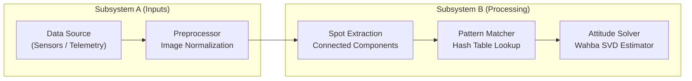

# High-Performance Mermaid Diagrams Standard

## Core Philosophy: Speed, Portability, and Zero Render Failure
Mermaid diagrams in Markdown must render instantaneously, without layout jitter, and without syntax parser errors across VS Code Markdown Preview, GitHub Web, and mobile viewers.

---

## 1. Engine & Direction Rules
1. **Always prefer `graph LR` or `graph TD`** over `flowchart`:
   - `graph` is the battle-tested, lightweight core engine.
   - It computes layout coordinates in O(N) with zero lag compared to heavy flowchart sub-engines.
2. **Subsystem Direction**:
   - Use `direction TB` inside each `subgraph` to stack components vertically while maintaining a clean horizontal (`LR`) overall system data flow.

---

## 2. Syntax Safety (100% Parser Compliant)
1. **Node IDs**:
   - Use strict identifier naming: `PREFIX_NAME` (e.g. `R1_API`, `L_PRE`, `U_DET`).
   - ONLY alphanumeric characters and underscores (`_`). NEVER use hyphens `-`, dots `.`, or spaces in IDs.
   - NEVER use Mermaid reserved keywords as IDs or aliases: `end`, `note`, `loop`, `alt`, `opt`, `par`, `subgraph`, `start`, `stop`.
2. **Node Labels**:
   - **ALWAYS wrap labels in double quotes**: `NODE_ID["Label Text"]`.
   - **NEVER use bare comparison symbols**: NEVER write `<`, `<=`, `>`, `>=` inside labels. They break the HTML lexer!
     - Write `le 5.0` or `up to 5.0` instead of `<= 5.0`.
     - Write `fewer than 4` instead of `< 4`.
     - Write `ge 1` or `at least 1` instead of `>= 1`.
3. **Layout Balancing with ` `**:
   - Never write long single-line labels. Use ` ` to break text into balanced rectangles:
     `R1_Models["ActiveRecord Models (27 models)"]`.
   - This dramatically speeds up Dagre rank-assignment layout algorithms.
4. **Shapes & Connectors**:
   - Use standard rectangular nodes `["..."]` or rounded nodes `("...")`.
   - Avoid nesting double-parens or complex cylinder syntax `[("...")]` when labels contain numbers or punctuation.
   - Prefer standard arrows `-->` and dotted dependency arrows `-.->`.

---

## 3. Reference Implementation Pattern

