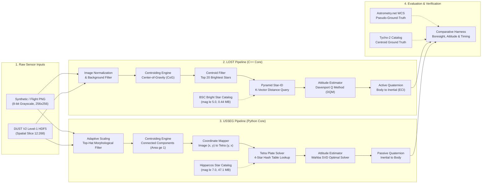
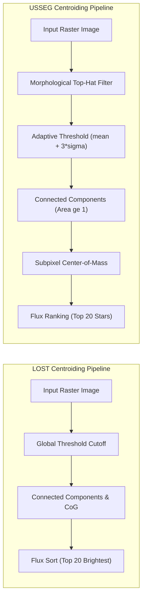
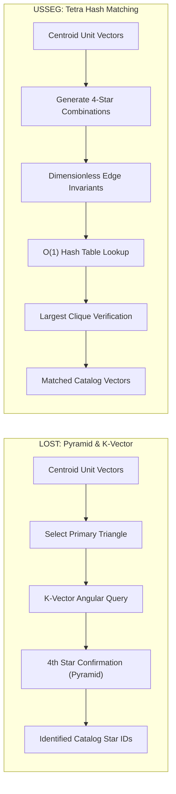
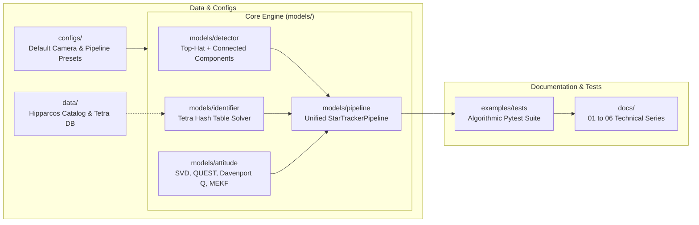

# System Architecture Specification
### *Đặc Tả Kiến Trúc Hệ Thống*

---

<!-- Language Switcher Bar -->

  
  &nbsp;&nbsp;
  

---

# Star Tracker System Architecture: LOST vs USSEG

This document presents the detailed architectural design of both the **LOST** (C++) and **USSEG** (Python) star tracker pipelines, their submodule integrations, and a comparative analysis of each pipeline component.

---

## 1. High-Level Architectural Comparison

Both systems solve the classic **Lost-In-Space (LIS)** problem: given an unidentified star field image taken by an onboard camera, detect star centroids, identify catalog stars by matching star patterns, and compute the spacecraft/camera attitude quaternion with respect to the Celestial Reference Frame (ICRF / ECI J2000).

*Figure 1: High-level comparison of LOST and USSEG end-to-end star tracking pipelines and evaluation harness.*

---

## 2. Pipeline Stage Breakdown

### 2.1 Stage 1: Preprocessing & Centroid Extraction

*Figure 2: Centroid detection workflows in LOST and USSEG.*

| Dimension | LOST Pipeline | USSEG Pipeline |
|---|---|---|
| **Implementation Language** | C++14 / C++17 | Python 3.10 (NumPy / SciPy / OpenCV) |
| **Algorithm** | Center-of-Gravity (CoG) with thresholding (`--centroid-algo=cog`) | Global threshold `mean + 3*sigma`, 8-connectivity contour bounding, local background subtraction |
| **Dynamic Range Handling** | Linear fixed offset and scale | Dynamic percentile scaling (`h5-scale.json` locked from dev set) |
| **Centroid Selection** | Selects brightest $N$ peaks (default 20 on flight frames) | Contours sorted by integrated flux, top 20 candidate centroids |
| **Subpixel Precision** | Intensity-weighted centroid formula around local peak | 2D image moment center of mass within connected component |
| **Coordinate System** | Zero-based $(x, y)$ column/row indices | Zero-based $(x, y)$, converted internally to $(y, x)$ for Tetra3 |

### 2.2 Stage 2: Star Identification (Star-ID)

*Figure 3: Star pattern recognition algorithms: LOST Pyramid vs USSEG Tetra3.*

| Dimension | LOST Pipeline | USSEG Pipeline |
|---|---|---|
| **Core Algorithm** | Pyramid Algorithm (Mortari et al.) accelerated by K-Vector table search | Tetra3 Hash-based 4-Star Combination Matching (ESA Tetra adaptation) |
| **Catalog** | Bright Star Catalog (BSC5) | Hipparcos Catalog (`hip_main.dat`, CDS I/239 complete 118,218 stars) |
| **Limiting Magnitude** | Magnitude $\le 5.0$ (sparse, optimized for low memory) | Magnitude $\le 7.0$ (dense, robust for small fields of view) |
| **Database Size** | ~0.443 MiB (for 26° FOV) | ~47.125 MiB (10°–30° multiscale) / ~3.14 MiB (45° single-scale) |
| **In-Memory Query Cost** | $O(1)$ range lookup via K-Vector | $O(1)$ hash table lookup of angular separation hash keys |
| **Failure Mode** | Returns no solve if insufficient pyramid triangles match | Early exit if no valid 4-star pattern matches hash catalog |

### 2.3 Stage 3: Attitude Determination

| Dimension | LOST Pipeline | USSEG Pipeline |
|---|---|---|
| **Algorithm** | Davenport Q Method (DQM) | Singular Value Decomposition (SVD) of Wahba Problem |
| **Loss Function** | Maximizes Wahba gain via quaternion eigenvalue decomposition | Minimizes weighted sum of squared vector residual errors via SVD |
| **Attitude Representation** | Unit Quaternion $\mathbf{q} = [w, x, y, z]$ (Scalar first) | Unit Quaternion $\mathbf{q} = [w, x, y, z]$ (Scalar first) |
| **Frame Convention** | Active rotation from camera body frame to inertial frame | Passive rotation from inertial frame to camera body frame |
| **Alignment Layer** | Native LOST output | Conjugate inversion layer (`quaternion_wxyz = conj(q_passive)`) |

---

## 3. Submodule Integration Architecture

To maintain maximum architectural modularity and allow reproducible comparative benchmarking, both `lost` and `lost-evals` are integrated into `usseg_startracker` via standard Git submodules under `submodules/`.

*Figure 4: Submodule layout and dependency flow within `usseg_startracker`.*

- **`submodules/lost`**: Tracks the official upstream C++ implementation (`https://github.com/UWCubeSat/lost.git`). Used to compile the reference `lost` binary CLI.
- **`submodules/lost-evals`**: Tracks the official evaluation framework (`https://github.com/UWCubeSat/lost-evals.git`). Contains the Monte Carlo generation scripts and evaluation pipelines.
- **`usseg_pipeline`**: The production-ready unified Python package providing a clean CLI (`python -m usseg_pipeline`) and programmatic API (`StarTrackerPipeline`) consumed by evaluation runners.

---

## 4. Key Architectural Trade-offs

1. **Memory Footprint vs Star Identification Density**:
   - LOST prioritizes ultra-low memory (~443 KB database, BSC mag $\le 5.0$), allowing it to fit into microcontrollers with constrained RAM. However, on faint flight images or small FOV sensors, fewer stars are visible, lowering recall.
   - USSEG utilizes the complete Hipparcos catalog down to magnitude 7.0 (~47 MB database), ensuring high all-sky star density (86.97% catalog coverage in 60 arcsec), but requiring more memory and longer search times when noise is present.

2. **Speed vs False Positive Immunity**:
   - LOST achieves higher FPS (>100 FPS compute) and lower latency (~3-8 ms compute) on low-noise synthetic images. However, when faced with high noise or flight blur, its pyramid solver can yield wrong attitudes (8% wrong solves in 45° high noise, 17.74% wrong solves on DUST H5).
   - USSEG’s 4-star Tetra3 hash matching enforces strict geometric constraints. In all synthetic pilot runs, USSEG yielded **0% wrong solves** (it prefers a clean `no_solve` early exit rather than corrupting spacecraft navigation with a false attitude).
