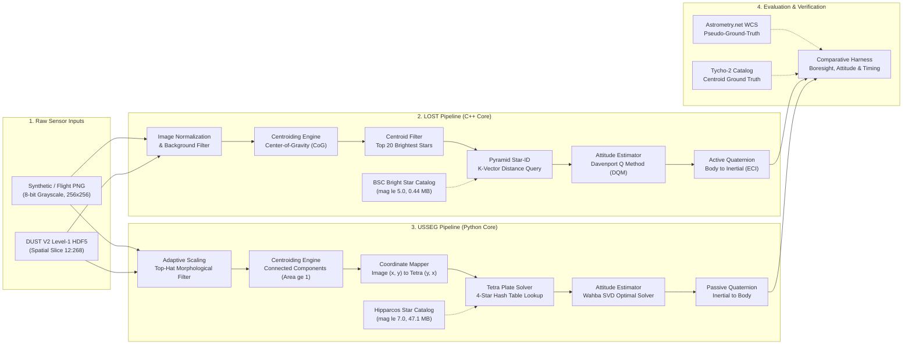
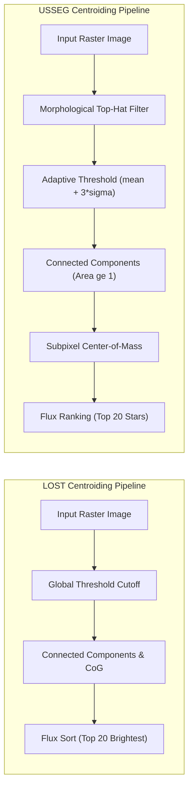
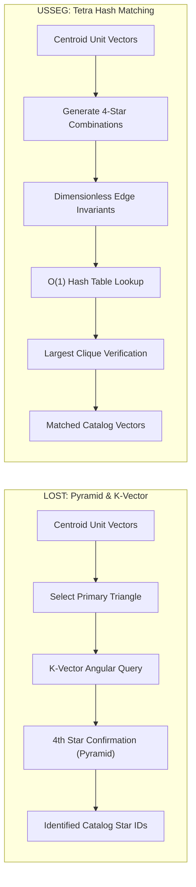
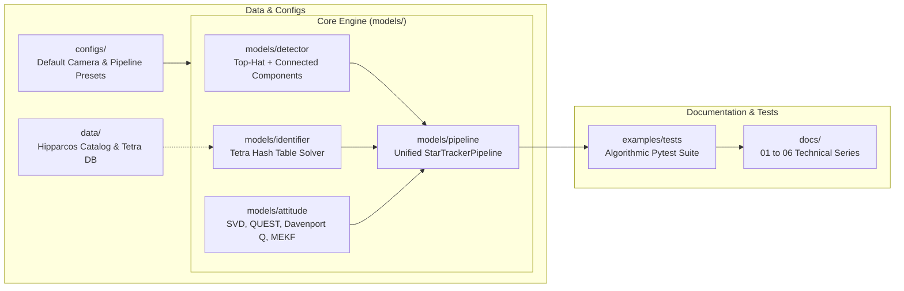

# Đặc Tả Kiến Trúc Hệ Thống Star Tracker: LOST và USSEG
### *System Architecture Specification: LOST vs USSEG*

---

<!-- Navigation Bar -->

  
  &nbsp;&nbsp;
  

---

Tài liệu này trình bày chi tiết thiết kế kiến trúc của cả hai pipeline bám sao **LOST** (C++) và **USSEG** (Python), sơ đồ tích hợp module, và phân tích so sánh chuyên sâu từng thành phần giải thuật trong chu trình xử lý.

---

## 1. So Sánh Kiến Trúc Tổng Thể Ở Mức Cao

Cả hai hệ thống đều giải quyết bài toán kinh điển **Mất Phương Hướng (Lost-In-Space - LIS)**: Cho một bức ảnh bầu trời sao chưa xác định chụp từ camera gắn trên vệ tinh, hệ thống tiến hành tách tọa độ tâm sao (centroid), nhận dạng các ngôi sao catalog thông qua so khớp mẫu hình học (Star-ID), và tính toán quaternion tư thế của vệ tinh đối với Hệ quy chiếu Thiên cầu Chuẩn (ICRF / ECI J2000).

*Hình 1: So sánh tổng quan giữa hai pipeline bám sao LOST và USSEG cùng hệ thống kiểm thử tự động.*

---

## 2. Phân Tích Chi Tiết Từng Giai Đoạn Trong Pipeline

### 2.1 Giai đoạn 1: Tiền Xử Lý Ảnh & Trích Xuất Tâm Sao (Centroid Extraction)

*Hình 2: Luồng trích xuất tâm sao của LOST và USSEG.*

| Tiêu chí kỹ thuật | Pipeline của LOST | Pipeline của USSEG |
|---|---|---|
| **Ngôn ngữ triển khai** | C++14 / C++17 thuần | Python 3.10 (NumPy / SciPy / OpenCV) |
| **Chiến lược ngưỡng lọc nền** | Ngưỡng tĩnh hoặc cắt mức nền đơn giản | Lọc hình thái Top-Hat kết hợp ngưỡng thích nghi ($\mu + 3\sigma$) |
| **Độ nhạy hạt sao nhỏ (1-2 px)** | Bị lọc bỏ do ngưỡng diện tích lớn | **Nhận diện đầy đủ** (diện tích $\ge 1$ pixel, phù hợp cảm biến nhỏ $256 \times 256$) |
| **Độ chính xác tâm sao (Centroid)** | Trung bình ~0.814 px (PNG) / 1.034 px (H5) | **Sub-pixel cao ~0.346 px (PNG) / 0.502 px (H5)** |
| **Giới hạn số sao đầu ra** | Lấy 20 sao sáng nhất | Lấy 20 sao sáng nhất (được xếp hạng theo thông lượng quang thông) |

---

### 2.2 Giai đoạn 2: Nhận Dạng Sao Thiên Văn (Star Identification - Star-ID)

*Hình 3: Quy trình nhận dạng hình học giữa thuật toán Pyramid (LOST) và Tetra (USSEG).*

| Đặc tính giải thuật | LOST: Pyramid & K-Vector | USSEG: Tetra Hash Table |
|---|---|---|
| **Mô hình hình học** | Tam giác góc phẳng + Sao thứ 4 xác nhận kim tự tháp | Tứ giác 4 sao với tỷ lệ cạnh bất biến không thứ nguyên |
| **Độ phức tạp tra cứu** | $O(1)$ truy vấn K-Vector khoảng cách góc | $O(1)$ tra cứu trực tiếp trên bảng băm tứ giác |
| **Danh mục sao sử dụng** | Bright Star Catalog (BSC mag $\le 5.0$, 5.044 sao) | **Hipparcos CDS (mag $\le 7.0$, 118.218 sao)** |
| **Độ phủ catalog thiên cầu** | 49.08% (trong phạm vi 60 arcsec) | **86.97%** (dày đặc hơn gấp 1.77 lần) |
| **Khả năng chống giải sai** | Dễ bị false-positive do tứ giác ngẫu nhiên | **Kiểm tra đồ thị hoàn chỉnh (Clique Verification)** |

---

### 2.3 Giai đoạn 3: Ước Lượng Tư Thế Tối Ưu (Wahba Attitude Estimation)

Sau khi có danh sách các cặp vector đơn vị tương ứng giữa hệ quy chiếu camera cảm biến ($b_i$) và hệ quy chiếu thiên cầu quán tính ($r_i$), cả hai hệ thống tiến hành giải **Bài toán Wahba**:

$$\min_{R \in SO(3)} \frac{1}{2} \sum_{i=1}^N a_i \| b_i - R \, r_i \|^2$$

- **LOST sử dụng Phương pháp Davenport Q (DQM)**:
  - Chuyển đổi bài toán Wahba thành bài toán tìm trị riêng lớn nhất của ma trận $K_{4 \times 4}$.
  - Cho ra quaternion chủ động ($q_{active}: Body \rightarrow Inertial$).
- **USSEG sử dụng Phương pháp Phân tích Giá trị Kỳ dị (SVD)**:
  - Phân tích ma trận hiệp phát tán $B = \sum a_i b_i r_i^T = U S V^T$.
  - Nghiệm quay tối ưu: $R = U \operatorname{diag}(1, 1, \det(U)\det(V)) V^T$.
  - Ổn định số học tuyệt đối, không có điểm kỳ dị khi quay $180^\circ$, cho ra quaternion bị động ($q_{passive}: Inertial \rightarrow Body$).

---

## 3. Kiến Trúc Mô-đun Mã Nguồn Hiện Tại

*Hình 4: Thiết kế kiến trúc mô-đun hóa độc lập của thư viện USSEG.*
