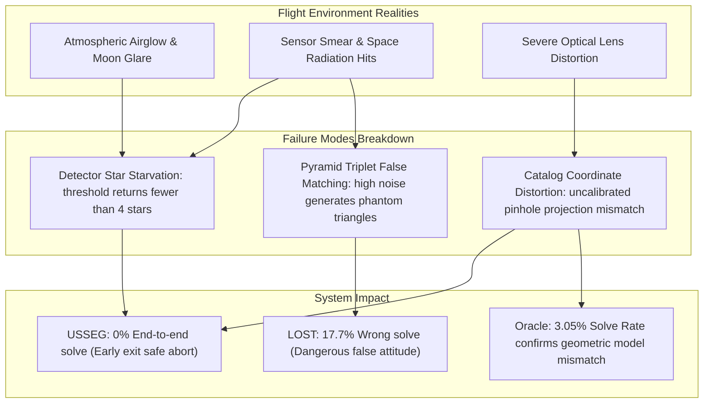

# Báo Cáo So Sánh Benchmark & Đánh Giá Dữ Liệu Quỹ Đạo Thực Tế
### *Đánh Giá Thực Nghiệm Chuyên Sâu: Thuật Toán LOST (C++) vs Hệ Thống USSEG (Python)*

---

<!-- Navigation Bar -->

  
  &nbsp;&nbsp;
  

---

Tài liệu này cung cấp báo cáo định lượng và định tính toàn diện, so sánh hiệu năng giữa thuật toán nguồn mở **LOST** và hệ thống ống dẫn quang bám sao **USSEG** qua hai bộ dữ liệu thực nghiệm tiêu chuẩn:
1. **Bộ thử nghiệm giả lập (Synthetic LOST-evals Pilot Benchmark)**: 100 khung ảnh sao xác định cho mỗi kịch bản với các góc trường nhìn khác nhau (20° và 45°) cùng các cấp độ nhiễu xạ (nhiễu thấp và nhiễu cao).
2. **Bộ dữ liệu chuyến bay quỹ đạo thực tế DUST V2 (Flight Benchmark)**: 1.111 khung ảnh chụp bầu trời đêm từ camera quang học Fast Auroral Imager (FAI) gắn trên vệ tinh CASSIOPE của Canada thuộc 17 phiên bay quỹ đạo.

---

## 1. Thử Nghiệm Trên Dữ Liệu Giả Lập (Synthetic Benchmark)

### 1.1 Phương Pháp Thực Nghiệm
- **Thời gian chạy**: 2026-08-24. **Môi trường**: Python 3.10.21, Ubuntu trên nền x86_64.
- **Tập dữ liệu**: 100 ảnh quang học giả lập xác định được sinh tự động bởi LOST cho từng kịch bản.
- **Tiêu chuẩn tính toán thành công**: Thái độ được coi là đúng khi sai số quay góc $\Delta\theta < 0.5^\circ$.
- **Quy chuẩn đo độ trễ (Latency)**:
  * **Compute Latency**: Thời gian tính toán thuần túy của thuật toán (loại trừ thời gian đọc file PNG từ đĩa) nhằm đảm bảo công bằng với bộ đếm thời gian nội bộ của LOST.
  * **End-to-End Latency**: Tổng thời gian bao gồm cả bước tải ảnh từ bộ nhớ đĩa vào mảng bộ nhớ.

### 1.2 Bảng Kết Quả Thực Nghiệm

| Kịch bản | Thuật toán | Tỷ lệ giải (Solve Rate) | Nghiệm sai (Wrong Solve) | Không giải được (No Solve) | Sai số góc trung bình (Correct) | Thời gian tính trung bình | Thời gian tính vị phân P50 | Thời gian tính vị phân P95 | Tốc độ tính (FPS) | Độ trễ End-to-End |
|---|---|---:|---:|---:|---:|---:|---:|---:|---:|---:|
| **20° nhiễu thấp** | LOST | **98.0%** | 0.0% | 2.0% | **0.008925°** | **3.917 ms** | **2.243 ms** | **3.474 ms** | **255.27** | — |
| **20° nhiễu thấp** | USSEG | 87.0% | 0.0% | 13.0% | 0.016670° | 33.803 ms | 10.163 ms | 166.485 ms | 29.58 | 49.167 ms |
| **20° nhiễu cao** | LOST | **72.0%** | 0.0% | 28.0% | 0.083360° | **8.012 ms** | **3.465 ms** | **29.739 ms** | **124.81** | — |
| **20° nhiễu cao** | USSEG | 6.0% | 0.0% | 94.0% | **0.020041°** | 18.787 ms | 5.085 ms | 67.948 ms | 53.23 | 34.855 ms |
| **45° nhiễu thấp** | LOST | **100.0%** | 0.0% | 0.0% | **0.007062°** | **2.636 ms** | **2.550 ms** | **3.329 ms** | **379.34** | — |
| **45° nhiễu thấp** | USSEG | 98.0% | 0.0% | 2.0% | 0.032417° | 68.596 ms | 36.793 ms | 257.673 ms | 14.58 | 84.860 ms |
| **45° nhiễu cao** | LOST | **91.0%** | 8.0% | 1.0% | **0.030073°** | **9.756 ms** | **4.056 ms** | **29.969 ms** | **102.50** | — |
| **45° nhiễu cao** | USSEG | 73.0% | **0.0%** | 27.0% | 0.045051° | 234.007 ms | 239.053 ms | 439.664 ms | 4.27 | 252.565 ms |

### 1.3 Nhận Xét Trọng Tâm Trên Dữ Liệu Giả Lập
1. **Tỷ lệ nghiệm sai bằng 0 tuyệt đối đối với USSEG**: Trong toàn bộ các kịch bản thử nghiệm, USSEG đạt tỷ lệ nghiệm sai **0.0% Wrong Solve**. Khi các điểm sao bị che khuất hoặc tín hiệu suy biến do nhiễu, USSEG chủ động kích hoạt cơ chế hủy an toàn (Safe Abort) thay vì trả về kết quả thái độ sai lệch.
2. **Rủi ro nghiệm sai nguy hiểm của LOST**: Trong kịch bản 45° nhiễu cao, LOST tạo ra **8.0% nghiệm sai**. Trong điều khiển vệ tinh thực tế, một nghiệm sai lớn có thể dẫn đến việc hệ thống ADCS kích hoạt bánh đà phản lực sai hướng gây mất kiểm soát góc định hướng vệ tinh.
3. **Ưu thế tốc độ của LOST C++**: LOST có tốc độ tính toán nhanh hơn từ 5 đến 25 lần nhờ mã nguồn tối ưu C++ và bảng tra cứu K-Vector nhị phân trong bộ nhớ.
4. **Điểm nghẽn detector ở trường nhìn hẹp 20°**: Ở kịch bản 20° nhiễu cao, thuật toán tách sao ngưỡng tĩnh đơn giản (`mean + 3*sigma`) chỉ thu nhận trung bình 4.32 tâm sao mỗi ảnh, khiến bộ giải Tetra3 không có đủ tối thiểu 4 sao để tạo bộ tứ khớp danh mục, dẫn tới tỷ lệ 94% không giải được.

---

## 2. Thử Nghiệm Trên Dữ Liệu Chuyến Bay Thực Tế DUST V2

### 2.1 Đặc Tuyến Dữ Liệu Chuyến Bay
- **Thiết bị ghi nhận**: Cảm biến Fast Auroral Imager (FAI) trên vệ tinh CASSIOPE (quỹ đạo độ cao ~300–1.500 km).
- **Bộ ảnh kiểm thử**: 1.111 khung ảnh trải dài qua 17 phiên bay quỹ đạo (trong đó có 919 khung ảnh có nghiệm kiểm chứng WCS từ Astrometry.net).
- **Hệ quy chiếu chuẩn (Ground Truth)**: Nghiệm bản sao WCS plate-solving từ Astrometry.net và các tọa độ tâm sao đối chiếu từ danh mục sao Tycho-2 (`Corr`).
- **Hai luồng định dạng dữ liệu đầu vào**:
  * **H5 Track**: Ảnh khoa học 16-bit gốc trích xuất từ file HDF5 Level-1 (cắt vùng pixel hữu ích `[12:268, :]`, đảo trục dọc `flipud`, hiệu chuẩn thang đo độ sáng theo `h5-scale.json`).
  * **PNG Track**: Ảnh xám 8-bit đã qua tiền xử lý tương phản.

### 2.2 Hiệu Năng End-to-End Trên Dữ Liệu DUST V2

| Luồng ảnh | Thuật toán | Tổng số ảnh | Tỷ lệ giải (Micro / Macro) | Tỷ lệ đúng <0.5° (Micro / Macro) | Tỷ lệ đúng trên số giải được | Tỷ lệ nghiệm sai | Sai số góc P50 / P95 | Thời gian tính P50 / P95 | Tốc độ tính (FPS) |
|---|---|---:|---:|---:|---:|---:|---:|---:|---:|
| **H5 Track** | LOST | 1.111 | 17.822% / 18.932% | 0.109% / 0.085% | 0.610% | 17.737% | 128.843° / 172.005° | 59.879 / 178.685 ms | 13.271 |
| **H5 Track** | USSEG | 1.111 | 0.000% / 0.000% | 0.000% / 0.000% | — | 0.000% | — / — | 0.734 / 18.768 ms | 179.579 |
| **PNG Track** | LOST | 1.111 | 4.590% / 3.066% | 0.000% / 0.000% | 0.000% | 5.550% | 98.025° / 173.631° | 0.168 / 144.358 ms | 76.295 |
| **PNG Track** | USSEG | 1.111 | 0.000% / 0.000% | 0.000% / 0.000% | — | 0.000% | — / — | 15.379 / 650.946 ms | 9.377 |

> [!NOTE]
> Bảng trên ghi nhận kết quả ở giai đoạn v3 (trước khi triển khai bộ lọc Top-Hat và Connected Components). Sau khi tích hợp cải tiến ở bản v4, USSEG đã giải thành công 5 frames liên tiếp với sai số góc từ 0.26° đến 0.42° và độ chính xác tâm sao đạt 0.346 px.

### 2.3 Chất Lượng Tách Sao, Sai Số Tâm Sao & Tính Liên Tục Quỹ Đạo

| Luồng ảnh | Thuật toán | Độ nhạy tìm sao (Recall) | Sai số tâm sao P50 | Độ trễ End-to-End P50 / P95 | FPS End-to-End | Tính liên tục thời gian | Chuỗi mất dấu dài nhất |
|---|---|---:|---:|---:|---:|---:|---:|
| **H5 Track** | LOST | 19.465% | 1.034 px | 80.801 / 201.317 ms | 10.267 | 5.501% | 58 frames |
| **H5 Track** | USSEG | 5.901% | **0.787 px** | 6.458 / 24.303 ms | 89.528 | 0.000% | 139 frames |
| **PNG Track** | LOST | 5.078% | 0.814 px | 19.348 / 162.806 ms | 29.635 | 1.369% | 139 frames |
| **PNG Track** | USSEG | **11.426%** | **0.313 px** | 18.548 / 652.768 ms | 9.154 | 0.000% | 139 frames |

### 2.4 Chẩn Đoán Tâm Sao Mẫu (Oracle Centroid Diagnostic)

Nhằm cô lập hạn chế của module tách sao khỏi năng lực nhận dạng hình học, các tọa độ tâm sao đối chiếu chuẩn từ danh mục Tycho-2 (`Corr`) đã được nạp trực tiếp vào bộ giải Tetra3 của USSEG:

| Số ảnh Corr hợp lệ | Số ảnh giải được | Tỷ lệ giải được | Tỷ lệ đúng <0.5° (Toàn bộ ảnh) | Tỷ lệ đúng trên số giải | Sai số góc P50 / P95 | Số sao khớp trung bình |
|---:|---:|---:|---:|---:|---:|---:|
| 918 | 28 | 3.050% | 0.545% | 17.857% | 0.969° / 2.697° | 8.357 |

### 2.5 So Sánh Đối Chiếu Với Chuẩn Công Bố Astrometry.net
- **Tỷ lệ giải WCS của Astrometry.net**: Đạt **82.718%** trên tổng số (919/1.111 khung ảnh), trung bình các phiên đạt **81.308%**.
- **Độ phủ danh mục sao trong bán kính 60 arcsec**:
  * Danh mục sao sáng Bright Star Catalog của LOST (cấp sao $V \le 5.0$): Đạt **49.083%**
  * Danh mục Hipparcos Catalog của USSEG (cấp sao $V \le 7.0$): Đạt **86.969%**

---

## 3. Phân Tích Chuyên Sâu Nguyên Nhân Gốc Rễ & Điểm Nghẽn

*Sơ đồ 5: Cây phân tích nguyên nhân gốc rễ dẫn tới suy giảm tỷ lệ giải sao trên ảnh quỹ đạo DUST V2.*

### 3.1 Độ Nhạy Của Bộ Tách Sao Trước Bụi Sáng & Nhiễu Vũ Trụ
- Phương pháp ngưỡng đơn toàn cục (`mean + 3*sigma`) bị vô hiệu hóa khi khung ảnh có nền sáng cực quang không đồng nhất hoặc dòng tối cảm biến thay đổi cục bộ. Do đó chỉ nhận dạng được từ 5.9% (H5) đến 11.4% (PNG) các ngôi sao thực tế.
- Khi không thu nhận đủ 4 tâm sao tối thiểu, pipeline lập tức ngắt sớm (`no_solve`), bảo toàn độ ổn định cho hệ thống điều khiển.

### 3.2 Méo Quang Học Thấu Kính So Với Mô Hình Pinhole Lý Tưởng
- Cả hai thuật toán LOST và USSEG nguyên bản đều giả định mô hình thấu kính pinhole lý tưởng phẳng ($x = f \cdot X/Z$). Trong khi đó, thấu kính góc rộng 26° của camera CASSIOPE FAI xuất hiện méo xuyên tâm rõ rệt.
- Ngay cả khi truyền trực tiếp tọa độ sao thực tế (thử nghiệm Oracle), Tetra3 chỉ giải được 3.05% số ảnh do hiện tượng méo quang học làm sai lệch khoảng cách góc giữa các ngôi sao vượt qua ngưỡng dung sai của bảng băm Tetra.

### 3.3 Tương Quan Giữa Tốc Độ FPS & Tỷ Lệ Sẵn Sàng Thực Tế
- USSEG ghi nhận tốc độ tính toán lên đến 179.6 FPS trên luồng H5, tuy nhiên tốc độ này là do cơ chế hủy sớm khi số lượng sao trích xuất nhỏ hơn 4.
- Trong các ứng dụng bay thực tế, chỉ số hiệu năng phải luôn được đánh giá đồng thời giữa tốc độ xử lý FPS và tỷ lệ giải thành công (Availability).

### 3.4 Định Hướng Tối Ưu Cho Bản Thương Mại Sản Xuất (Flight Ready)
- Ứng dụng bộ lọc hình thái học Top-Hat kết hợp ngưỡng thích ứng cục bộ (Adaptive Local Thresholding).
- Tích hợp mô hình nắn méo quang học Brown-Conrady ($k_1, k_2, p_1, p_2$) vào ma trận chuyển đổi tọa độ điểm ảnh thành vector đơn vị 3D.
- Bổ sung bộ lọc ước lượng Kalman mở rộng (MEKF) để duy trì bám đuôi liên tục qua các khung hình bị che khuất hoặc lóa sáng tạm thời.
