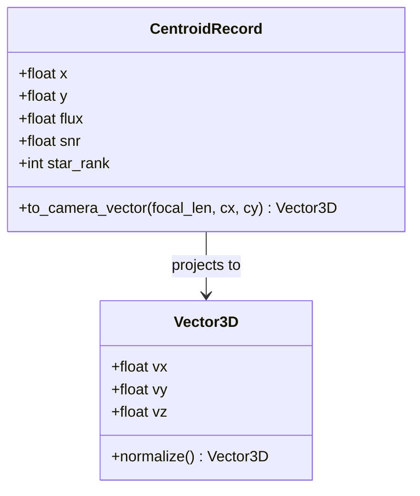
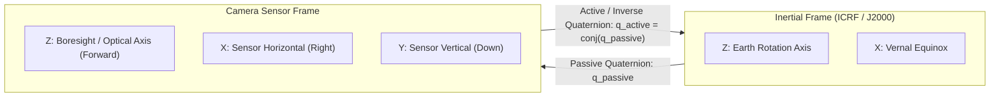

<div align="center">

# Từ Điển Dữ Liệu, Hệ Quy Chiếu & Định Dạng Schemas
### *Đặc Tả Cấu Trúc Dữ Liệu Đầu Vào / Đầu Ra Của Hệ Thống USSEG Star Tracker*

---

<!-- Navigation Bar -->
<p>
  <a href="../README.md#-tài-liệu-tiếng-việt"></a>
  &nbsp;&nbsp;
  <a href="README.md"></a>
</p>

---

</div>

Tài liệu này đặc tả tường minh từ điển dữ liệu chuẩn, cấu trúc schema đầu vào/đầu ra, các hệ quy chiếu tọa độ thiên văn, và quy ước quaternion được sử dụng xuyên suốt trong hệ thống pipeline USSEG và bộ công cụ đánh giá benchmark.

---

## 1. Định Dạng & Quy Chuẩn Dữ Liệu Cảm Biến Đầu Vào

### 1.1 Khung Ảnh Xám PNG Giả Lập & Đã Tiền Xử Lý
- **Định dạng file**: Portable Network Graphics (`.png`)
- **Độ sâu màu (Bit Depth)**: Số nguyên không dấu 8-bit (`uint8`, khoảng giá trị 0 đến 255).
- **Kênh màu (Channels)**: 1 kênh (Ảnh mức xám grayscale đơn kênh).
- **Hệ tọa độ ảnh (Image Coordinates)**: Gốc tọa độ $(0, 0)$ đặt tại điểm ảnh trên cùng bên trái (Top-Left):
  * $x \in [0, W-1]$: Chỉ số cột pixel theo chiều ngang (hướng từ trái sang phải).
  * $y \in [0, H-1]$: Chỉ số hàng pixel theo chiều dọc (hướng từ trên xuống dưới).

### 1.2 Ảnh Khoa Học HDF5 DUST V2 (FAI Level-1)
- **Định dạng file**: Hierarchical Data Format 5 (`.h5` / `.hdf5`)
- **Đường dẫn trường dữ liệu (Dataset Path)**: `/images` hoặc `/FAI_image` (mảng 2D hoặc 3D chứa số nguyên không dấu 16-bit).
- **Quy trình chuẩn hóa ảnh đầu vào**:
  1. **Cắt vùng pixel hữu ích (Spatial Cropping)**: `raw_image[12:268, :]` trích xuất 256 dòng CCD hoạt động tích cực.
  2. **Chuẩn hóa hướng cảm biến (Orientation Normalization)**: `np.flipud(...)` đảo trục dọc để khớp hướng lắp đặt quang học của cảm biến trên vệ tinh.
  3. **Lượng tử hóa & Thang đo (Quantization & Scaling)**: Chuyển đổi động sang 8-bit dựa vào hệ số hiệu chuẩn trong `h5-scale.json`:
     $$I_{8} = \text{clip}\left(\frac{I_{16} - I_{\min}}{I_{\max} - I_{\min}} \times 255, 0, 255\right)$$

---

## 2. Schema Dữ Liệu Tách Tâm Sao (Centroid Extraction)


*Sơ đồ 6: Mô hình biểu diễn dữ liệu tâm sao và phép chiếu vector đơn vị 3D.*

### 2.1 Mô Tả Các Trường Dữ Liệu Của Centroid

| Tên trường | Kiểu dữ liệu | Đơn vị | Khoảng giá trị | Diễn giải chi tiết |
|---|---|---|---|---|
| `x` | `float64` | pixel | $[0.0, W-1.0]$ | Tọa độ ngang dưới điểm ảnh (sub-pixel, gốc 0). |
| `y` | `float64` | pixel | $[0.0, H-1.0]$ | Tọa độ dọc dưới điểm ảnh (sub-pixel, gốc 0). |
| `flux` | `float64` | ADU | $[0.0, \infty)$ | Tổng năng lượng tích phân của đốm sao sau khi trừ phông nền. |
| `snr` | `float64` | tỉ số | $[0.0, \infty)$ | Tỉ số tín hiệu trên nhiễu: cường độ đỉnh so với phương sai phông nền. |
| `star_rank` | `int32` | thứ tự | $[1, 20]$ | Thứ hạng độ sáng trong số các đốm sao trích xuất (1 = sáng nhất). |

---

## 3. Schema Danh Mục Cơ Sở Dữ Liệu Sao

### 3.1 Bright Star Catalog (BSC5) - Sử Dụng Bởi LOST
- **Phạm vi bao phủ**: Toàn thiên cầu, các ngôi sao có cấp sao thị giác $V \le 5.0$.
- **Dung lượng database**: ~0.443 MiB định dạng nhị phân chuyên dụng.

| Trường dữ liệu | Kiểu | Diễn giải |
|---|---|---|
| `bsc_id` | `int32` | Mã định danh sao Bright Star Catalog (chỉ số Harvard Revised). |
| `ra_rad` | `float64` | Góc xích kinh (Right Ascension) tính bằng radian (kỷ nguyên ICRF / J2000). |
| `dec_rad` | `float64` | Góc xích vĩ (Declination) tính bằng radian (kỷ nguyên ICRF / J2000). |
| `vmag` | `float32` | Cấp sao thị giác (Visual Magnitude). |
| `unit_vector` | `float64[3]` | Vector đơn vị Descartes $[v_x, v_y, v_z]$ trên mặt cầu thiên văn. |

### 3.2 Hipparcos Catalog (`hip_main.dat`, CDS I/239) - Sử Dụng Bởi USSEG
- **Phạm vi bao phủ**: Đầy đủ 118.218 ngôi sao với cấp sao thị giác $V \le 7.0$.
- **Dung lượng file cơ sở dữ liệu**: Nén định dạng NumPy (`default_database.npz`, ~47.1 MiB).

| Trường dữ liệu | Kiểu | Diễn giải |
|---|---|---|
| `hip_id` | `int32` | Mã định danh sao Hipparcos (từ 1 đến 120404). |
| `ra_deg` | `float64` | Góc xích kinh tính bằng độ (kỷ nguyên J2000). |
| `dec_deg` | `float64` | Góc xích vĩ tính bằng độ (kỷ nguyên J2000). |
| `vmag` | `float32` | Cấp sao thị giác (băng thông Johnson V). |
| `bv_color` | `float32` | Chỉ số màu B-V. |
| `star_table` | `float64[N, 3]` | Danh sách vector đơn vị trong hệ quy chiếu quán tính J2000. |
| `pattern_catalog` | `int32[M, 4]` | Danh sách tổ hợp chỉ số 4 ngôi sao tương ứng với khóa bảng băm. |

---

## 4. Quy Ước Quaternion Thái Độ & Hệ Quy Chiếu Không Gian

### 4.1 Biểu Diễn Quaternion
Thái độ của vệ tinh được biểu diễn dưới dạng quaternion đơn vị 4 phần tử đã chuẩn hóa:
$$\mathbf{q} = [w, x, y, z]^T, \quad w^2 + x^2 + y^2 + z^2 = 1$$
trong đó $w$ là phần vô hướng (scalar-first) và $[x, y, z]$ là phần vector 3 chiều.

### 4.2 Phân Biệt Quy Ước Quaternion Chủ Động & Bị Động


*Sơ đồ 7: Phép biến đổi tọa độ giữa hệ quy chiếu quán tính ECI J2000 và hệ quy chiếu camera cảm biến.*

- **Biểu diễn nội bộ của USSEG**: Sử dụng quaternion bị động $\mathbf{q}_{I \to C}$ biến đổi vector từ hệ quán tính (ECI J2000) sang hệ tọa độ camera:
  $$\mathbf{v}_C = \mathbf{q}_{I \to C} \otimes \mathbf{v}_I \otimes \mathbf{q}_{I \to C}^*$$
- **Biểu diễn của LOST & Ground Truth chuẩn**: Sử dụng quaternion chủ động $\mathbf{q}_{C \to I}$ ánh xạ tọa độ camera về hệ quán tính:
  $$\mathbf{v}_I = \mathbf{q}_{C \to I} \otimes \mathbf{v}_C \otimes \mathbf{q}_{C \to I}^*$$
- **Đẳng thức chuyển đổi**:
  $$\mathbf{q}_{C \to I} = \mathbf{q}_{I \to C}^* = [w, -x, -y, -z]^T$$

---

## 5. Định Dạng Schemas Đầu Ra Của Bộ Đánh Giá Benchmark

### 5.1 Bản Ghi JSON Đầu Ra (`usseg_pipeline` Execution)
Mỗi khung ảnh sau khi giải nghiệm sẽ xuất ra một bản ghi JSON có cấu trúc chuẩn:
```json
{
  "frame_id": "0.png",
  "status": "solved",
  "fov_deg": 20.0,
  "quaternion_wxyz": [0.999847, 0.012301, -0.008912, 0.009102],
  "quaternion_passive_wxyz": [0.999847, -0.012301, 0.008912, -0.009102],
  "num_detected_stars": 18,
  "num_matched_stars": 12,
  "residual_rmse_deg": 0.00891,
  "timings_ns": {
    "detection_ns": 4210500,
    "plate_solve_ns": 8912400,
    "attitude_ns": 112000,
    "total_ns": 13234900
  },
  "compute_fps": 75.56
}
```

### 5.2 Bảng Tổng Hợp Kết Quả Thực Nghiệm (`smoke_test_usseg.summary.csv`)
Các cột dữ liệu tiêu chuẩn:
1. `scenario`: Tên kịch bản thử nghiệm (ví dụ `20-low-noise`, `45-high-noise`, `dust-dev`).
2. `algorithm`: Tên thuật toán (`lost` hoặc `usseg`).
3. `total_frames`: Tổng số khung ảnh được nạp vào đánh giá.
4. `solve_count`: Số lượng khung ảnh giải ra nghiệm.
5. `solve_rate`: Tỷ lệ phần trăm khung ảnh giải thành công.
6. `correct_sub_05_deg`: Tỷ lệ ảnh giải đúng có sai số thái độ $< 0.5^\circ$.
7. `wrong_solve_rate`: Tỷ lệ nghiệm sai có sai số thái độ $\ge 0.5^\circ$.
8. `attitude_error_p50_deg`: Trung vị sai số góc quay (độ).
9. `compute_latency_p50_ms`: Trung vị thời gian tính toán của thuật toán (mili-giây).
10. `compute_fps`: Tốc độ xử lý khung hình trên giây.
