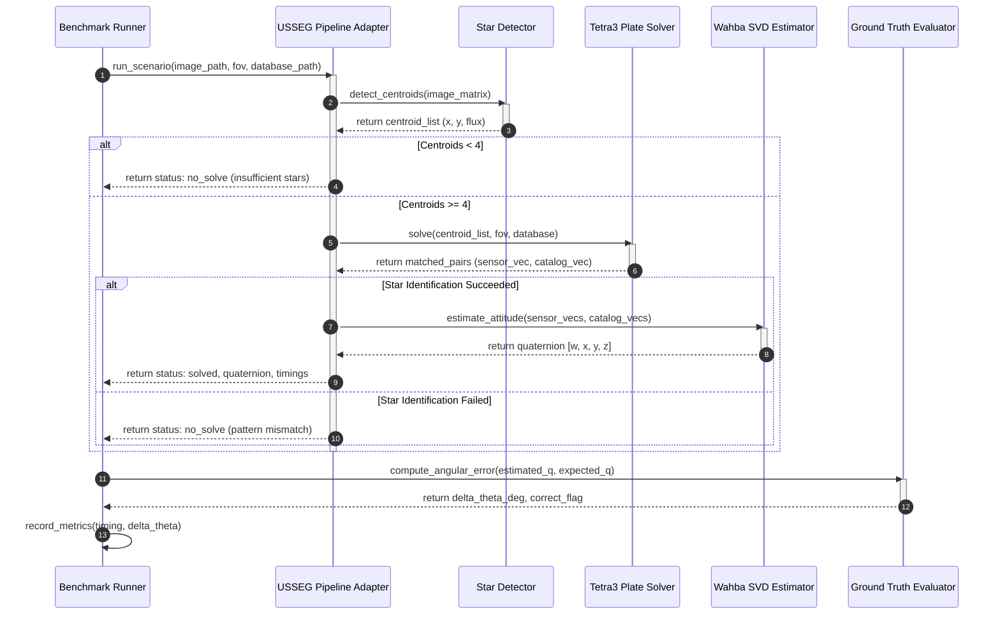
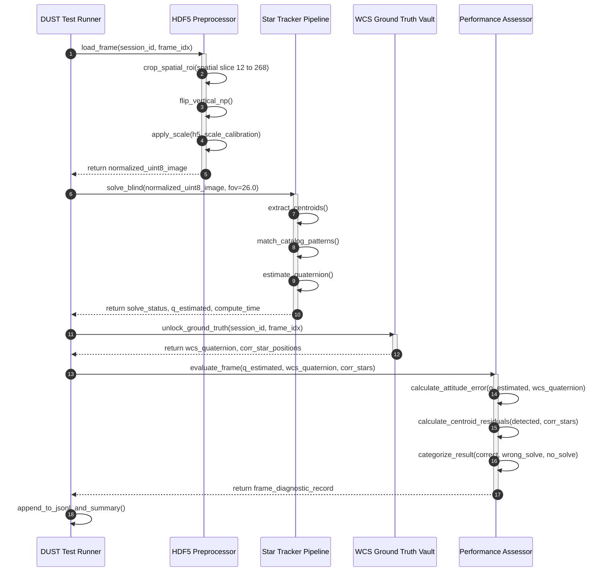
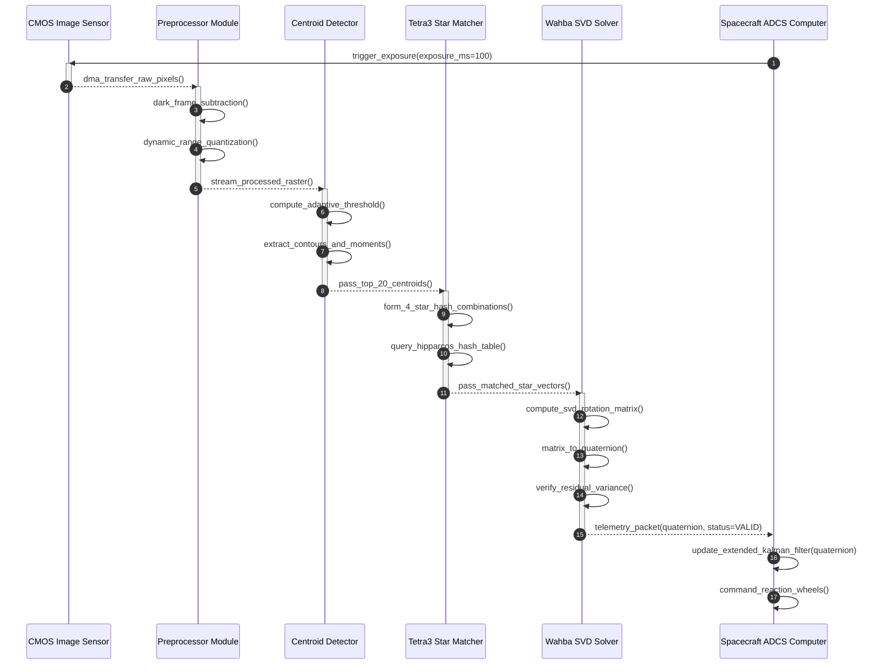

# Sơ Đồ Tuần Tự & Quy Trình Thực Thi Hệ Thống
### *Đặc Tả Quy Trình Thực Thi Runtime: Benchmark Giả Lập, Thẩm Định Dữ Liệu Bay & Vòng Lặp Bám Sao*

---

<!-- Navigation Bar -->

  
  &nbsp;&nbsp;
  

---

Tài liệu này chi tiết hóa các bước thực thi qua các sơ đồ tuần tự (Sequence Diagrams) thể hiện quy trình luân chuyển dữ liệu và xử lý thời gian thực giữa các module: từ quy trình benchmark giả lập, quy trình thẩm định mù ảnh chuyến bay thực tế DUST V2, cho đến chu kỳ điều khiển bám sao tự động Lost-In-Space trên vệ tinh.

---

## 1. Quy Trình Thực Thi Benchmark Dữ Liệu Giả Lập

Sơ đồ này mô tả cách bộ điều phối benchmark nạp từng lô ảnh quang học xác định qua pipeline, trích xuất tâm sao, nhận dạng góc mẫu và đối chiếu với nghiệm chuẩn:

*Sơ đồ 8: Sơ đồ tuần tự đánh giá dữ liệu ảnh sao giả lập.*

---

## 2. Quy Trình Thẩm Định Mù Dữ Liệu Chuyến Bay Thực Tế DUST V2

Quy trình thẩm định mù (Blind Evaluation Protocol) trên ảnh bay vệ tinh CASSIOPE FAI: Các thuật toán thực hiện giải nghiệm hoàn toàn độc lập trước khi mở khóa cơ sở dữ liệu nghiệm kiểm chứng WCS và danh mục Tycho-2.

*Sơ đồ 9: Sơ đồ tuần tự thẩm định mù và đánh giá độc lập dữ liệu bay DUST V2.*

---

## 3. Chu Kỳ Điều Khiển Bám Sao Tự Động Lost-In-Space Trên Vệ Tinh

Quy trình mô tả chu kỳ thời gian thực tự động của hệ thống USSEG Star Tracker khi vận hành trên máy tính nhúng vệ tinh CubeSat hoặc máy bay không người lái UAV:

*Sơ đồ 10: Sơ đồ tuần tự chu kỳ bám sao tự động Lost-In-Space (LIS) tích hợp máy tính điều khiển ADCS.*
