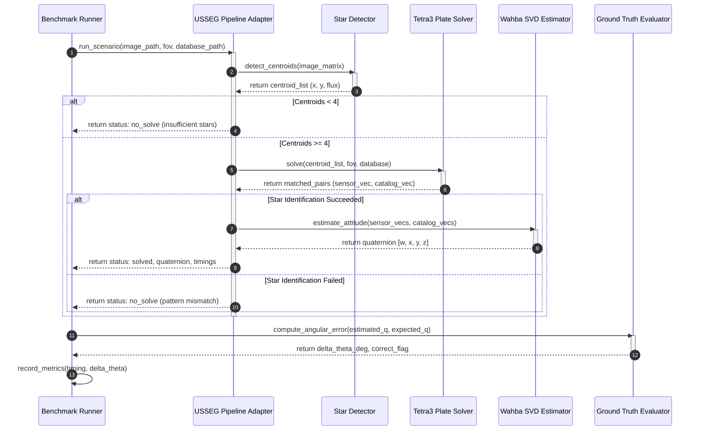
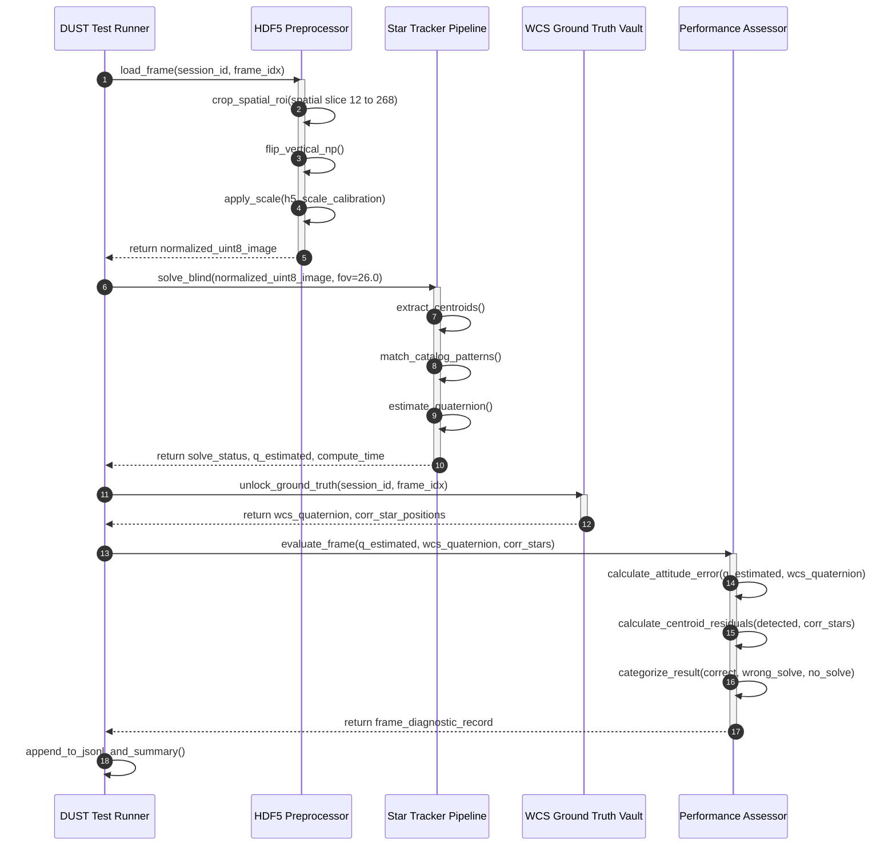
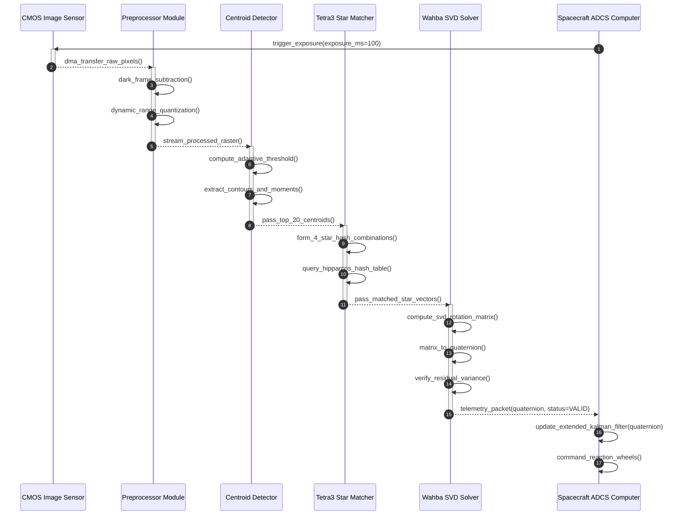

# System Sequence Diagrams & Runtime Workflows
### *Sơ Đồ Tuần Tự & Quy Trình Thực Thi*

---

<!-- Language Switcher Bar -->

  
  &nbsp;&nbsp;
  

---

# Star Tracker Sequence Diagrams: Execution & Runtime Flows

This document details the step-by-step sequence diagrams showing the runtime and request flows for synthetic benchmarking, real-flight DUST V2 validation, and autonomous Lost-In-Space spacecraft operation.

---

## 1. Synthetic Benchmarking Execution Flow

This workflow illustrates how the evaluation harness executes a batch of deterministic synthetic star scenes through the candidate algorithm and measures accuracy against ground truth.

*Figure 8: Sequence diagram for synthetic star image evaluation flow.*

---

## 2. Real-Flight DUST V2 Evaluation & Validation Flow

This workflow shows the blind evaluation protocol on CASSIOPE FAI flight images, where algorithms run completely blind before WCS pseudo-ground-truth and Tycho-2 catalogs are consulted.

*Figure 9: Sequence diagram for blind DUST V2 flight evaluation and validation protocol.*

---

## 3. Autonomous Onboard Lost-In-Space (LIS) Operational Cycle

This workflow illustrates the autonomous realtime flight cycle aboard a CubeSat or Drone Star Tracker running the unified USSEG package.

*Figure 10: Sequence diagram for autonomous onboard Lost-in-Space (LIS) cycle.*
