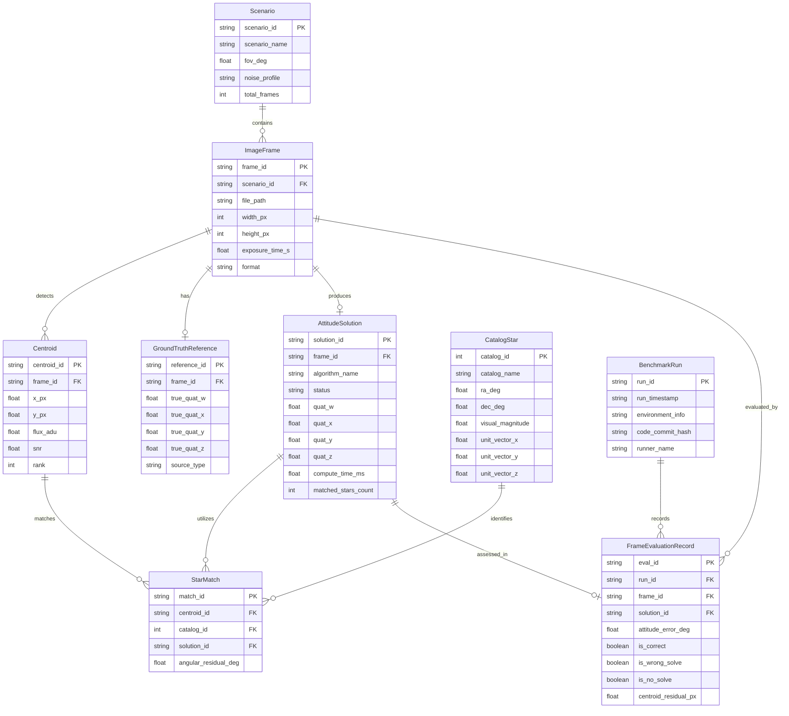

# Mô Hình Quan Hệ Thực Thể & Lược Đồ Miền Dữ Liệu
### *Đặc Tả Mô Hình Quan Hệ: Kịch Bản Thử Nghiệm, Khung Ảnh, Tâm Sao, Danh Mục & Nghiệm Thái Độ*

---

<!-- Navigation Bar -->

  
  &nbsp;&nbsp;
  

---

Tài liệu này xác định mô hình dữ liệu quan hệ (Entity-Relationship Data Model) kết nối các kịch bản thử nghiệm, khung ảnh quang học, tọa độ tâm sao trích xuất, danh mục sao chuẩn, các cặp sao nhận dạng được, nghiệm quaternion thái độ và các chỉ số đo lường hiệu năng trong toàn bộ hệ thống bám sao.

---

## 1. Sơ Đồ Thực Thể Quan Hệ (Entity-Relationship Diagram)

*Sơ đồ 11: Mô hình thực thể quan hệ giữa các thành phần dữ liệu trong hệ thống Star Tracker.*

---

## 2. Từ Điển Thực Thể & Chi Tiết Thuộc Tính

### 2.1 Thực Thể `Scenario` (Kịch Bản Thử Nghiệm)
Đại diện cho một cấu hình thử nghiệm hoặc điều kiện giả lập:
- `scenario_id` (PK, string): Mã định danh duy nhất (ví dụ: `20-low-noise`, `dust-v2-test`).
- `fov_deg` (float): Góc trường nhìn của camera tính bằng độ.
- `noise_profile` (string): Đặc tính phân bố nhiễu (`ideal`, `low_gaussian`, `flight_auroral`).
- `total_frames` (int): Tổng số khung ảnh trong kịch bản.

### 2.2 Thực Thể `ImageFrame` (Khung Ảnh Quang Học)
Khung ảnh riêng lẻ từ cảm biến chụp hoặc ma trận điểm ảnh giả lập:
- `frame_id` (PK, string): Mã định danh khung ảnh (ví dụ: `0.png`, `2023_06_19_001.h5`).
- `file_path` (string): Đường dẫn tương đối hoặc tuyệt đối trên hệ thống tập tin.
- `width_px`, `height_px` (int): Kích thước độ phân giải ngang và dọc tính bằng pixel.
- `exposure_time_s` (float): Thời gian phơi sáng của màn trập tính bằng giây.

### 2.3 Thực Thể `Centroid` (Tọa Độ Tâm Sao Trích Xuất)
Đốm sáng ứng viên ngôi sao được module detector trích xuất:
- `centroid_id` (PK, string): Mã định danh đốm sáng duy nhất trong khung ảnh.
- `x_px`, `y_px` (float): Tọa độ dưới điểm ảnh (sub-pixel, gốc 0).
- `flux_adu` (float): Năng lượng tích phân của đốm sáng sau khi trừ phông.
- `snr` (float): Tỉ số tín hiệu trên nhiễu của đốm sáng.
- `rank` (int): Thứ hạng độ sáng trong số các đốm sáng ứng viên trích xuất được.

### 2.4 Thực Thể `CatalogStar` (Ngôi Sao Danh Mục Thiên Văn)
Vật thể thiên văn chuẩn từ các danh mục quốc tế:
- `catalog_id` (PK, int): Mã định danh sao (chỉ số BSC hoặc chỉ số Hipparcos HIP).
- `catalog_name` (string): Tên danh mục nguồn (`BSC5` hoặc `Hipparcos`).
- `ra_deg`, `dec_deg` (float): Tọa độ xích kinh và xích vĩ trong kỷ nguyên J2000 tính bằng độ.
- `unit_vector_x/y/z` (float): Vector Descartes 3 chiều chuẩn hóa trên mặt cầu thiên văn.

### 2.5 Thực Thể `StarMatch` (Cặp Sao Nhận Dạng Khớp)
Mối liên kết tương ứng giữa tâm sao 2D trích xuất từ cảm biến và ngôi sao 3D trong danh mục:
- `match_id` (PK, string): Mã định danh cặp sao khớp.
- `angular_residual_deg` (float): Khoảng cách góc dư giữa vector đo từ cảm biến (sau khi quay) và vector sao chuẩn trong danh mục.

### 2.6 Thực Thể `AttitudeSolution` (Nghiệm Thái Độ & Dữ Liệu Vận Hành)
Quaternion thái độ ước lượng và các thông số giám sát quá trình giải:
- `solution_id` (PK, string): Mã định danh phiên nghiệm thái độ.
- `status` (string): Trạng thái giải (`solved`, `no_solve`, `timeout`, `error`).
- `quat_w`, `quat_x`, `quat_y`, `quat_z` (float): Các thành phần quaternion đơn vị (scalar-first).
- `compute_time_ms` (float): Tổng thời gian tính toán của các giai đoạn thuật toán (mili-giây).

### 2.7 Thực Thể `GroundTruthReference` (Nghiệm Thái Độ Chuẩn Đối Chứng)
Nghiệm thái độ chuẩn chính xác dùng để đối soát sai số:
- `reference_id` (PK, string): Mã định danh bản ghi chuẩn đối chứng.
- `true_quat_w/x/y/z` (float): Các thành phần quaternion thái độ thực tế.
- `source_type` (string): Nguồn nghiệm chuẩn (`simulator_exact`, `astrometry_wcs_pseudotruth`).

### 2.8 Thực Thể `FrameEvaluationRecord` (Bản Ghi Đánh Giá Khung Hình)
Kết quả đối chiếu sai số giữa nghiệm `AttitudeSolution` của pipeline và nghiệm chuẩn `GroundTruthReference`:
- `eval_id` (PK, string): Mã định danh bản ghi đánh giá.
- `attitude_error_deg` (float): Sai số góc quay trắc địa giữa nghiệm ước lượng và nghiệm chuẩn:
  $$\Delta\theta = 2 \arccos(|\mathbf{q}_{est} \cdot \mathbf{q}_{true}|)$$
- `is_correct` (boolean): `true` nếu $\Delta\theta < 0.5^\circ$.
- `is_wrong_solve` (boolean): `true` nếu giải ra nghiệm nhưng $\Delta\theta \ge 0.5^\circ$.
- `is_no_solve` (boolean): `true` nếu pipeline không tìm được nghiệm.
