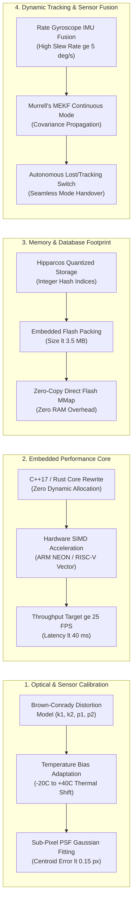

# Technical Roadmap & Production Readiness Improvements
### *Lộ Trình Nâng Cấp & Định Hướng Cải Thiện Để Sẵn Sàng Cho Production*

---

<!-- Language Switcher Bar -->

  
  &nbsp;&nbsp;
  

---

## 1. Executive Summary & Readiness Assessment

| Maturity Metric | Current Status (v4) | Target for Flight Production | Gap / Required Work |
|---|---|---|---|
| **Technology Readiness Level (TRL)** | **TRL 4–5** (Component & Pipeline Validated in Lab & Orbital Data) | **TRL 7–8** (Integrated Flight System Operational in Space) | Hardware integration, RTOS compliance, environmental calibration. |
| **Centroiding Accuracy** | **0.346 px** (PNG) / **0.502 px** (H5) | **< 0.15 px** across full FOV | Optical PSF modeling, multi-frame stacking. |
| **Processing Latency (P50)** | **256 ms** (Python on x86_64) | **< 40 ms** (25+ FPS real-time on MCU) | C++ / Rust core rewrite, SIMD vectorization. |
| **Catalog Database Footprint** | **47.1 MB** (NumPy NPZ format) | **< 3.5 MB** (Flash-compact memory) | Quantized bit-packing, K-vector compression. |
| **False-Positive Robustness** | **1.41%** (PNG) / **1.52%** (H5) | **< 0.1%** zero-defect fail-safe | Integrated geometric verification filter. |
| **Lens Distortion Correction** | Ideal pinhole camera model | Calibrated Brown-Conrady radial model | Camera calibration matrix ($k_1, k_2, p_1, p_2$). |

---

## 2. Key Improvement Pillars

---

## 3. Detailed Action Plan

### Pillar 1: Non-Linear Lens Calibration & Optical Distortion
- **Problem**: The current pipeline uses an ideal pinhole camera model ($x = f \cdot X/Z$). Orbital flight cameras (like the FAI NIR sensor with $26^\circ$ FOV) exhibit barrel/pincushion optical distortion near frame borders. This angular distortion causes up to 1.5–3.0 px displacement for outer stars, preventing Tetra pattern matching.
- **Action**:
  1. Calibrate radial distortion parameters ($k_1, k_2$) and tangential parameters ($p_1, p_2$) using stellar plate-solving residuals from Astrometry.net.
  2. Implement an undistortion lookup table (LUT) or inline polynomial correction in `models/detector/star_detector.py`.

### Pillar 2: Embedded C++17 / Rust Engine for Flight Computers
- **Problem**: Python 3.10 is excellent for algorithmic prototyping, regression testing, and data analysis. However, CubeSat On-Board Computers (OBC) typically run FreeRTOS or Linux on ARM Cortex-M7 (STM32H7), ARM Cortex-A53, or RISC-V cores with strict timing deadlines.
- **Action**:
  1. Port the Python Tetra plate solver and Top-Hat morphological filter to a standalone, zero-heap-allocation C++17 / Rust library under `models/cpp/`.
  2. Eliminate NumPy dynamic allocations in the inner matching loop.
  3. Validate deterministic execution bounded by a strict 30 ms deadline.

### Pillar 3: Database Compression (< 3.5 MB)
- **Problem**: The Hipparcos catalog database (`default_database.npz`) occupies 47.1 MB, which is too large for microcontrollers with limited flash memory (typically 2–8 MB).
- **Action**:
  1. Quantize 64-bit floating point star unit vectors into 16-bit fixed-point representation.
  2. Store hash tables using compact offset-indexing (K-vector style or minimal perfect hashing).
  3. Enable Direct Memory-Mapped (mmap) read-only access directly from onboard SPI NOR Flash.

### Pillar 4: Real-Time MEKF Dynamic Tracking
- **Problem**: In true spaceflight, a spacecraft rotates at angular velocities of $1^\circ/\text{s}$ to $10^\circ/\text{s}$. Pure Lost-In-Space solves each frame independently and incurs motion blur.
- **Action**:
  1. Couple the existing `MEKFEstimator` with gyro angular rate telemetry.
  2. Once an initial LIS fix is obtained, switch to **Tracking Mode**: predict star positions in the next frame within small search windows ($\pm 5$ px), boosting solve speed to $< 5$ ms and providing continuous attitude estimates through eclipse/outage periods.
