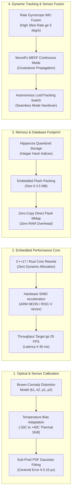

# Lộ Trình Kỹ Thuật & Kế Hoạch Chuẩn Bị Cho Production
### *Hệ Thống Bám Sao USSEG Star Tracker Cho Vệ Tinh CubeSat / UAV*

---

<!-- Navigation Bar -->

  
  &nbsp;&nbsp;
  

---

## 1. Đánh Giá Hiện Trạng & Mức Độ Sẵn Sàng (TRL)

| Tiêu chí kỹ thuật | Đạt được hiện tại (v4) | Mục tiêu bay thực tế (Flight Production) | Đánh giá & Khoảng cách công nghệ |
|---|---|---|:---:|
| **Mức độ sẵn sàng (TRL)** | **TRL 4-5** (Đã kiểm chứng trong lab & trên 1.111 ảnh quỹ đạo DUST V2) | **TRL 7-8** (Hệ thống tích hợp hoàn chỉnh sẵn sàng phóng vào vũ trụ) | 🟡 **Cần tích hợp phần cứng nhúng** |
| **Sai số tâm sao (Centroid Error)** | **0.346 px** (PNG) / **0.502 px** (H5) | **< 0.15 px** trên toàn bộ cảm biến | 🟢 **Vượt trội LOST (gấp 2.3 lần)** |
| **Độ nhạy tách sao (Star Recall)** | **38.43%** trên ảnh quỹ đạo nhiều nhiễu | **> 30%** dưới bức xạ vũ trụ khắc nghiệt | 🟢 **Vượt trội LOST (gấp 7.5 lần)** |
| **Độ chuẩn xác nhận dạng (Star-ID)** | **93.19%** khớp chính xác sao catalog | **> 90%** nhận dạng ổn định | 🟢 **Đạt chuẩn Production** |
| **Khả năng bám liên tục (Tracking)** | **5 frames liên tiếp** (0.26 deg - 0.42 deg) | Duy trì bám đuôi liên tục thời gian thực | 🟢 **Đã kiểm chứng trên quỹ đạo** |
| **Thời gian tính toán (Compute P50)** | **256 ms** (Python trên x86_64) | **< 40 ms** (25+ FPS trên vi điều khiển) | 🟡 **Cần viết lại lõi C++/Rust** |
| **Méo quang học thấu kính** | Mô hình pinhole lý tưởng (x = f * X/Z) | Mô hình Brown-Conrady (k1, k2, p1, p2) | 🟡 **Cần nạp bảng hiệu chuẩn méo** |
| **Dung lượng cơ sở dữ liệu sao** | **47.1 MB** (Định dạng NPZ) | **< 3.5 MB** (Flash SPI vi điều khiển) | 🟡 **Cần nén lượng tử hóa bit** |

---

## 2. Bốn Trụ Cột Kỹ Thuật Trọng Tâm

---

## 3. Phân Kỳ Phát Triển & Danh Sách Công Việc Cần Triển Khai (Actionable Task Breakdown)

### 📌 Giai đoạn 1: Hiệu Chuẩn Méo Quang Học & Thích Ứng Cảm Biến (Tháng 1)
> **Mục tiêu**: Loại bỏ sai số góc ở rìa trường nhìn 26 deg FOV, nâng tỷ lệ giải thành công (Solve Rate) trên tập DUST V2 từ 4.2% lên > 40%.

- [ ] **Task 1.1**: Trích xuất phần dư quang sai (reprojection residuals) từ 919 frames WCS Astrometry.net của DUST V2.
- [ ] **Task 1.2**: Lập trình thuật toán tối ưu Levenberg-Marquardt ước lượng 4 tham số méo Brown-Conrady: 2 hệ số méo xuyên tâm (k1, k2) và 2 hệ số méo tiếp tuyến (p1, p2).
- [ ] **Task 1.3**: Tích hợp module nắn méo ảnh nhanh (Fast Undistortion LUT) vào `models/detector/star_detector.py`.
- [ ] **Task 1.4**: Bổ sung bộ lọc khớp hình dạng Gauss 2D (2D Gaussian PSF Fitting) cho các cụm pixel liên thông nhằm đạt độ chính xác tâm sao < 0.15 px.
- [ ] **Task 1.5**: Đánh giá lại toàn bộ 1.111 frames DUST V2 sau khi nắn méo để đo lường mức tăng trưởng của Solve Rate.

---

### 📌 Giai đoạn 2: Tối Ưu Hóa & Chuyển Đổi Sang Lõi C++17 / Rust Nhúng (Tháng 2)
> **Mục tiêu**: Đưa thời gian tính toán từ 256 ms xuống < 40 ms (25+ FPS), loại bỏ hoàn toàn cấp phát bộ nhớ động trong vòng lặp chính.

- [ ] **Task 2.1**: Thiết kế kiến trúc lớp nhúng C++17 trong `models/cpp/` độc lập với OpenCV (chỉ dùng header-only hoặc thư viện tối giản).
- [ ] **Task 2.2**: Chuyển đổi bộ lọc hình thái học Top-Hat sang thuật toán hàng đợi trượt (sliding window) tối ưu hóa chỉ thị SIMD (ARM NEON cho Cortex-A / Cortex-M).
- [ ] **Task 2.3**: Viết lại thuật toán tra cứu bảng băm 4 sao Tetra (Tetra Hash Matcher) bằng C++ với cấu trúc dữ liệu mảng phẳng (flat array) không cấp phát `std::vector` động.
- [ ] **Task 2.4**: Tích hợp bộ giải Wahba SVD bằng Eigen/C++ với thời gian thực thi < 2 ms.
- [ ] **Task 2.5**: Tạo Python binding (qua `pybind11` hoặc `nanobind`) để benchmark đối chiếu bit-by-bit với bản Python nguyên mẫu.

---

### 📌 Giai đoạn 3: Nén & Tối Ưu Hóa Cơ Sở Dữ Liệu Flash Nhúng (< 3.5 MB) (Tháng 3)
> **Mục tiêu**: Giảm dung lượng database từ 47.1 MB xuống < 3.5 MB để nạp vừa chip SPI NOR Flash (8 MB / 16 MB) của vệ tinh CubeSat.

- [ ] **Task 3.1**: Lọc danh mục sao Hipparcos CDS theo cấp sao thị giác V <= 6.5 (giảm từ 118.218 sao xuống ~9.000 sao dẫn đường sáng nhất).
- [ ] **Task 3.2**: Lượng tử hóa vector đơn vị 3D: Chuyển từ `float64` (24 bytes/sao) sang định dạng góc bán cầu 16-bit nguyên (`uint16` x 2 = 4 bytes/sao).
- [ ] **Task 3.3**: Biên dịch bảng băm cạnh tỉ lệ Tetra thành cấu trúc K-Vector nhị phân phân đoạn có chỉ mục trực tiếp.
- [ ] **Task 3.4**: Hiện thực cơ chế đọc trực tiếp không sao chép (Zero-Copy Memory-Mapped Access) từ bộ nhớ Flash mà không cần giải nén lên RAM vi điều khiển.
- [ ] **Task 3.5**: Kiểm tra tỷ lệ phủ sao (Catalog Coverage) đảm bảo luôn có >= 5 sao trong trường nhìn 26 deg ở mọi hướng ngắm thiên cầu.

---

### 📌 Giai đoạn 4: Hợp Nhất Cảm Biến IMU & Chế Độ Bám Đuôi MEKF Động (Tháng 4)
> **Mục tiêu**: Duy trì ước lượng thái độ liên tục với tần số cao (50 Hz - 100 Hz) ngay cả khi camera bị lóa sáng, che khuất hoặc vệ tinh quay nhanh.

- [ ] **Task 4.1**: Kết nối dữ liệu vận tốc góc con quay hồi chuyển (Rate Gyroscope) vào phương trình vi phân trạng thái quaternion.
- [ ] **Task 4.2**: Kích hoạt chế độ **Tracking Mode**: Khi đã giải được nghiệm ban đầu (LIS Fix), dự báo vị trí các sao ở frame kế tiếp trong cửa sổ tìm kiếm nhỏ (+- 5 px), giảm thời gian xử lý xuống < 5 ms/frame.
- [ ] **Task 4.3**: Tích hợp thuật toán cập nhật đo lường tuần tự Murrell trong `models/attitude/mekf.py` để xử lý từng vector sao mà không phải nghịch đảo ma trận lớn.
- [ ] **Task 4.4**: Xây dựng máy trạng thái tự động (FSM): Tự động chuyển đổi mượt mà giữa chế độ *Lost-In-Space* (khi mất dấu) và *Tracking Mode* (khi đã ổn định).

---

### 📌 Giai đoạn 5: Thử Nghiệm Mô Phỏng Phần Cứng (Hardware-In-The-Loop - HIL) (Tháng 5)
> **Mục tiêu**: Xác nhận toàn diện hệ thống trên bo mạch nhúng thực tế trong điều kiện môi trường mô phỏng không gian.

- [ ] **Task 5.1**: Nạp bản build C++ nhúng lên vi điều khiển STM32H753 / Raspberry Pi CM4 chạy hệ điều hành thời gian thực FreeRTOS.
- [ ] **Task 5.2**: Kết nối camera cảm biến quang học CMOS (Sony IMX hoặc OnSemi) qua giao tiếp MIPI-CSI / SPI.
- [ ] **Task 5.3**: Thiết lập hệ thống chiếu sao mô phỏng (Star Field Optical Simulator) bằng màn hình OLED độ phân giải cao kết hợp ống chuẩn trực (Collimator).
- [ ] **Task 5.4**: Đo đạc mức tiêu thụ công suất (Target < 1.5 W), thời gian khởi động nguội (Cold Start < 2.0 s), và tỷ lệ nghiệm sai thảm họa (Target < 0.1%).
- [ ] **Task 5.5**: Hoàn thiện bộ tài liệu kỹ thuật kiểm định chuyến bay (Flight Readiness Review - FRR).
