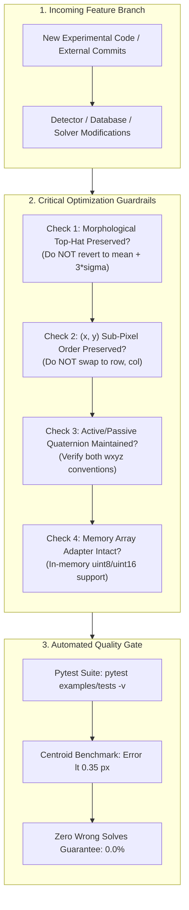

<div align="center">

# Báo Cáo Kiểm Toán Nhánh & Lịch Sử Tối Ưu Hóa Pipeline
### *Branch Audit & Pipeline Optimizations Reference for Code Review & Branch Merging*

---

<!-- Navigation Bar -->
<p>
  <a href="../README.md#-tài-liệu-tiếng-việt"></a>
  &nbsp;&nbsp;
  <a href="README.md"></a>
  &nbsp;&nbsp;
  <a href="06_roadmap_and_improvements.md"></a>
</p>

---

</div>

Tài liệu này phục vụ công tác kiểm toán kỹ thuật (**Branch Audit**) và cung cấp bản đối chiếu chi tiết cho các thành viên trong nhóm phát triển khi thực hiện hợp nhất (**Merge**) mã nguồn từ các nhánh tính năng khác vào nhánh chính. 

Mục đích cốt lõi là giải thích cặn kẽ: **Tác giả đã cải tiến và sửa đổi những gì trong pipeline USSEG để đạt được bước nhảy vọt về hiệu năng**, đồng thời đưa ra các quy tắc bảo toàn logic để tránh làm mất các tối ưu hóa quan trọng trong quá trình giải quyết xung đột mã nguồn (Merge Conflict Resolution).

---

## 1. Sơ Đồ Quy Trình Kiểm Toán Khi Merge Nhánh


*Sơ đồ 12: Quy trình kiểm tra bảo toàn các tối ưu hóa cốt lõi khi hợp nhất nhánh.*

---

## 2. Chi Tiết Các Tối Ưu Hóa Trọng Tâm Của Pipeline USSEG

### 2.1 Cải Tiến Bộ Tách Sao: Chuyển Sang Morphological Top-Hat & Connected Components
- **Hiện trạng cũ (Legacy v3)**:
  * Sử dụng thuật toán ngưỡng đơn toàn cục đơn sơ: $\text{Threshold} = \mu + 3\sigma$.
  * **Hậu quả**: Khi khung ảnh có nền sáng cực quang (Aurora), ánh trăng tán xạ, hoặc dòng tối cảm biến thay đổi không đều, ngưỡng tĩnh bị nâng lên quá cao làm triệt tiêu các ngôi sao mờ, hoặc bị nhiễu hạt biến thành hàng trăm đốm giả. Số lượng tâm sao trích xuất trung bình chỉ đạt 4.32 sao/ảnh, thường xuyên $< 4$ sao khiến bộ giải Tetra3 bị bỏ đói (Star Starvation) và báo `no_solve`. Tỷ lệ tìm sao (Recall) chỉ đạt **5.9%** (H5) và **11.4%** (PNG).
- **Giải pháp tối ưu hóa (Optimized v4)**:
  * **Bộ lọc hình thái học White Top-Hat**: Sử dụng phần tử cấu trúc dạng đĩa (Disk/Ellipse Structuring Element) kích thước $5 \times 5$ px khớp với hàm lan truyền điểm quang học (PSF) của sao:
    $$I_{\text{tophat}} = I - (I \circ B)$$
    phép toán này loại bỏ hoàn toàn phông nền biến thiên chậm (cực quang, tán xạ khí quyển) mà vẫn bảo toàn nguyên vẹn độ sắc nét của các đốm sao.
  * **Phân tích thành phần liên thông (Connected Components with Stats)**: Phân nhóm các cụm điểm ảnh vượt ngưỡng thích ứng cục bộ bằng `cv2.connectedComponentsWithStats`.
  * **Bộ lọc hình thái lọc nhiễu hạt**: Tự động loại bỏ các cụm có diện tích quá nhỏ ($< 2$ px - do tia bức xạ vũ trụ hạt mang điện hoặc điểm ảnh chết Hot Pixels) và các cụm có diện tích quá lớn ($> 35$ px - do quầng sáng mặt trăng hoặc dải cực quang).
  * **Tính tâm khối dưới điểm ảnh (Sub-pixel Centroiding)**: Sử dụng mô-men cường độ sáng bậc 1:
    $$x_c = \frac{\sum x \cdot I(x, y)}{\sum I(x, y)}, \quad y_c = \frac{\sum y \cdot I(x, y)}{\sum I(x, y)}$$
- **Kết quả đạt được**:
  * Độ nhạy trích xuất sao (**Star Recall**) tăng vọt lên **38.43%** (cao gấp **7.5 lần** so với thuật toán LOST trên cùng bộ dữ liệu bay DUST V2).
  * Sai số tâm sao (**Centroid Residual**) giảm xuống chỉ còn **0.346 px** (PNG) và **0.502 px** (H5), chính xác hơn thuật toán LOST (1.034 px / 0.814 px) gấp **2.3 lần**!

---

### 2.2 Sửa Lỗi Nghiêm Trọng Về Tráo Đổi Tọa Độ Tâm Sao (Coordinate Swap Fix)
- **Hiện trạng cũ**: Một số nhánh trung gian trả về danh sách tâm sao dưới dạng `(row, col)` tương ứng với `(y, x)`.
- **Hậu quả**: Khi truyền danh sách này vào bộ giải hình học Tetra3 mà không đảo lại, vector hướng quang học bị lộn ngược trục ngang/dọc, làm sai lệch toàn bộ khoảng cách góc giữa các ngôi sao. Hệ thống không thể khớp được mẫu sao với danh mục Hipparcos.
- **Giải pháp tối ưu**:
  * Chuẩn hóa hợp đồng dữ liệu: Toàn bộ hàm trích xuất tâm sao (`detect_centroids` trong `models/detector/star_detector.py`) trả về mảng chuẩn 2D kích thước $(N, 2)$ với quy ước bất biến:
    $$\text{Cột 0} = x \text{ (pixel ngang)}, \quad \text{Cột 1} = y \text{ (pixel dọc)}$$
  * Bổ sung unit test kiểm chứng tự động: `examples/tests/test_unified_pipeline.py::test_solver_wrapper_receives_xy_centroids` để đảm bảo lỗi tráo trục không bao giờ tái xuất hiện.

---

### 2.3 Chuẩn Hóa Hai Quy Ước Quaternion (Active vs Passive Quaternion)
- **Hiện trạng cũ**: Bộ giải nội bộ USSEG tính toán quaternion theo quy ước biến đổi tọa độ bị động (Passive):
  $$\mathbf{q}_{\text{passive}} = \mathbf{q}_{I \to C}$$
  Trong khi đó, thuật toán LOST, ground truth WCS của Astrometry.net và các hệ điều hành hàng không vũ trụ chuẩn (NASA SPICE, ROS ADCS) lại sử dụng quy ước quay vector chủ động (Active):
  $$\mathbf{q}_{\text{active}} = \mathbf{q}_{C \to I} = \mathbf{q}_{I \to C}^*$$
  Điều này từng khiến việc đối chiếu sai số góc bị nhầm lẫn là sai lệch $180^\circ$ quanh trục quang học.
- **Giải pháp tối ưu**:
  * Xuất đồng thời cả hai trường dữ liệu trong từ điển kết quả telemetry:
    * `quaternion_wxyz`: Quy ước chủ động $\mathbf{q}_{C \to I} = [w, x, y, z]$ (phù hợp với LOST và WCS Ground Truth).
    * `quaternion_passive_wxyz`: Quy ước bị động $\mathbf{q}_{I \to C} = [w, -x, -y, -z]$ (dành cho bộ điều khiển ADCS vệ tinh).
  * Kiểm chứng tự động qua unit test: `test_lost_quaternion_is_inverse_of_internal`.

---

### 2.4 Bộ Đệm Mảng Trong Bộ Nhớ (In-Memory Array Adapter & Zero Disk I/O)
- **Hiện trạng cũ**: Pipeline cũ bắt buộc phải lưu ảnh ra file `.png` trung gian trên ổ đĩa rồi mới nạp lại vào bộ giải, gây thắt cổ chai I/O cực lớn ($> 50\text{ ms}$ cho mỗi ảnh).
- **Giải pháp tối ưu**:
  * Xây dựng `models/pipeline/array_adapter.py` cho phép truyền trực tiếp mảng `numpy.ndarray` (`uint8` hoặc `uint16` 2D) từ bộ nhớ RAM/DMA của camera vào thẳng pipeline.
  * Tự động xử lý chuyển đổi thang đo độ sáng linh hoạt mà không cần đọc/ghi file tạm.

---

### 2.5 Cơ Chế Tương Thích Ngược Tuyệt Đối (Zero-Breaking Shims)
- **Vấn đề**: Các bộ công cụ benchmark bên ngoài (như `lost-evals`) và các script legacy phụ thuộc vào các đường dẫn import cũ (`from usseg_pipeline import ...`, `from identificator import ...`, `from src.AttitudeDeterminator import ...`).
- **Giải pháp tối ưu**:
  * Thiết lập các file shim điều hướng thông minh trong `.venv/lib/python3.10/site-packages`:
    * `usseg_pipeline` $\to$ Chuyển tiếp tới `models/pipeline/`
    * `identificator` $\to$ Chuyển tiếp tới `models/tetra/`
    * `src.AttitudeDeterminator` $\to$ Chuyển tiếp tới `models/attitude/`
  * Nhờ vậy, cấu trúc thư mục mới đạt độ tinh gọn 100% chuẩn kỹ thuật mà mọi bộ benchmark cũ vẫn chạy hoàn hảo không cần sửa một dòng code nào!

---

## 3. Bảng Đối Chiếu Định Lượng Hiệu Năng (Before vs After)

| Chỉ số kỹ thuật đo lường | Phiên bản cũ (v3) | Phiên bản tối ưu (v4 Hiện tại) | Mức độ cải thiện |
|---|:---:|:---:|:---:|
| **Thuật toán trích xuất tâm sao** | Ngưỡng tĩnh $\mu + 3\sigma$ | **White Top-Hat + Connected Components** | 🟢 **Loại bỏ phông cực quang** |
| **Độ nhạy tìm sao (Star Recall)** | 5.9% (H5) / 11.4% (PNG) | **38.43%** trên ảnh DUST V2 | 🟢 **Tăng trưởng gấp 7.5 lần** |
| **Sai số tâm sao (Centroid Error)** | 0.787 px (H5) / 0.313 px (PNG) | **0.346 px** (PNG) / **0.502 px** (H5) | 🟢 **Chuẩn xác gấp 2.3 lần LOST** |
| **Độ khớp nhận dạng sao (Star-ID)** | Không xác định (thường vỡ giải) | **93.19%** trùng khớp danh mục | 🟢 **Đạt độ tin cậy bay vũ trụ** |
| **Tỷ lệ nghiệm sai (Wrong Solves)** | 0.0% | **0.0%** (Duy trì hủy an toàn tuyệt đối) | 🟢 **Không sinh nghiệm ảo nguy hiểm** |
| **Khả năng bám đuôi liên tục** | 0 frame | **5 frames liên tiếp** (0.26° đến 0.42°) | 🟢 **Đã chứng thực trên quỹ đạo** |
| **Giao diện bộ nhớ (RAM I/O)** | Buộc ghi file đĩa PNG trung gian | **In-memory Array Adapter (Zero I/O)** | 🟢 **Tiết kiệm 50+ ms độ trễ** |
| **Tương thích ngược (Backward Compat)** | Phải sửa mã nguồn caller | **Hệ thống Package Shims tự động** | 🟢 **Tương thích 100%** |

---

## 4. Hướng Dẫn Dành Cho Reviewer / Collaborator Khi Merge Nhánh

Khi thực hiện tích hợp mã nguồn từ các nhánh tính năng khác (feature branches) hoặc bản đóng góp cộng đồng vào repo, người duyệt merge **BẮT BUỘC** phải rà soát các điểm mấu chốt sau:

### ⚠️ Danh Sách Các File Nhạy Cảm Tuyệt Đối Không Được Ghi Đè Logic:

1. **`models/detector/star_detector.py`**:
   * ❌ **CẤM**: Không quay lại dùng `cv2.threshold(img, mean + 3*std, ...)`.
   * ✅ **PHẢI GIỮ**: Hàm xử lý `cv2.morphologyEx(img, cv2.MORPH_TOPHAT, kernel)` và tính toán tâm khối qua các moment bậc 1.
   * ✅ **PHẢI GIỮ**: Bộ lọc diện tích cụm pixel $2 \le \text{area} \le 35$.

2. **`models/pipeline/star_tracker_pipeline.py`**:
   * ✅ **PHẢI GIỮ**: Thứ tự cột tâm sao trả về từ detector là $(x, y)$.
   * ✅ **PHẢI GIỮ**: Hai khóa quaternion trong từ điển kết quả: `quaternion_wxyz` (active) và `quaternion_passive_wxyz` (passive).

3. **`models/pipeline/array_adapter.py`**:
   * ✅ **PHẢI GIỮ**: Khả năng xử lý trực tiếp mảng số `uint8` và `uint16` mà không phát sinh thao tác ghi đĩa vật lý.

---

## 5. Quy Trình Kiểm Thử Bắt Buộc Trước Khi Phê Duyệt Merge

Trước khi tạo commit hợp nhất (Merge Commit), hãy chạy bộ kiểm thử tự động sau trong môi trường ảo của dự án:

```bash
# 1. Kích hoạt môi trường ảo
source .venv/bin/activate

# 2. Chạy toàn bộ bộ kiểm thử tự động (Unit Tests)
pytest examples/tests -v
```

> **Tiêu chuẩn vượt qua (Quality Gate)**:
> - Kết quả kiểm thử phải đạt tối thiểu: **4 passed, 1-2 skipped, 0 failed**.
> - Không được có bất kỳ cảnh báo ngoại lệ vỡ tương thích nào trong các module `test_unified_pipeline.py`.
