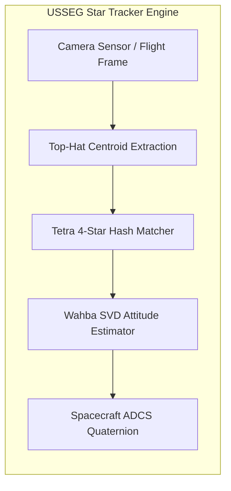

# 📚 USSEG Star Tracker Documentation

**Engineering & Architecture Documentation Index**  
*Mục lục Tài liệu Kỹ thuật & Thiết kế Kiến trúc Hệ thống*

---

<!-- Language Switcher Bar -->

  
  &nbsp;&nbsp;
  

---

 

## 🇬🇧 English Documentation

### 📑 Document Index (Numbered Series)

| # | Document | Focus Topics & Diagrams |
|:---:|---|---|
| **01** | **[System Architecture](01_system_architecture.md)** | Architectural comparison between LOST (C++) and USSEG (Python), end-to-end pipeline diagrams, Centroiding, Star-ID, and Wahba attitude solvers. |
| **02** | **[Benchmark Comparison](02_benchmark_comparison.md)** | Empirical results on synthetic fixtures and DUST V2 real-world flight imagery (1,111 frames), timing, recall, and root cause analysis. |
| **03** | **[Data Dictionary & Schemas](03_data_dictionary_and_schemas.md)** | Formal input/output JSON schemas, pixel coordinates, catalogs (BSC vs CDS Hipparcos), and quaternion conventions ($q_{active}$ vs $q_{passive}$). |
| **04** | **[Sequence Diagrams](04_sequence_diagrams.md)** | Runtime execution sequence diagrams for synthetic benchmarking, blind orbital evaluation, and autonomous onboard LIS tracking. |
| **05** | **[Entity-Relationship Model](05_entity_relationship.md)** | Relational data model connecting scenarios, image frames, centroids, matched stars, and attitude solution metrics. |
| **06** | **[Roadmap & Improvements](06_roadmap_and_improvements.md)** | Production readiness analysis, optical calibration, embedded C++ porting, and flash database compression roadmap. |

---

### 🏛️ Architecture Overview

---

  

---

## 🇻🇳 Tài Liệu Tiếng Việt

### 📑 Danh Mục Tài Liệu Kỹ Thuật (Được đánh số thứ tự)

| Số hiệu | Tài liệu | Nội dung trọng tâm |
|:---:|---|---|
| **01** | **[Kiến trúc Hệ thống](01_system_architecture.md)** | So sánh kiến trúc LOST (C++) và USSEG (Python), sơ đồ pipeline từ đầu đến cuối, giải thuật trích xuất tâm sao, Star-ID và ước lượng tư thế Wahba. |
| **02** | **[Báo cáo So sánh Benchmark](02_benchmark_comparison.md)** | Kết quả thực nghiệm trên ảnh giả lập và 1.111 frames dữ liệu quỹ đạo thực tế DUST V2, phân tích độ trễ, độ nhạy và nguyên nhân sai số. |
| **03** | **[Từ điển Dữ liệu & Schemas](03_data_dictionary_and_schemas.md)** | Định dạng dữ liệu chuẩn JSON, hệ tọa độ ảnh, danh mục sao (BSC so với CDS Hipparcos), quy ước quaternion chủ động và bị động. |
| **04** | **[Sơ đồ Tuần tự Thực thi](04_sequence_diagrams.md)** | Sơ đồ tuần tự các bước chạy thực nghiệm tổng hợp, quy trình đánh giá ảnh chuyến bay thực tế và chu kỳ bám sao tự động trên quỹ đạo. |
| **05** | **[Mô hình Thực thể Quan hệ](05_entity_relationship.md)** | Mô hình dữ liệu quan hệ kết nối giữa các kịch bản thử nghiệm, khung ảnh, tọa độ tâm sao, sao danh mục và các chỉ số sai số thái độ. |
| **06** | **[Lộ Trình Cải Thiện & Sẵn Sàng Cho Production](06_roadmap_and_improvements.md)** | Đánh giá mức độ trưởng thành (TRL 4-5 lên TRL 7-8), hiệu chuẩn méo thấu kính, viết lại C++ nhúng và nén cơ sở dữ liệu Flash. |
