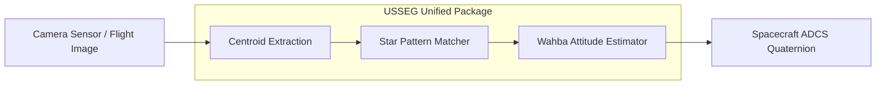

# Star Tracker Architecture & Evaluation Documentation

Welcome to the engineering and architectural documentation for the **USSEG Star Tracker** module, featuring comparative evaluation against the **LOST** star tracking library.

---

## 1. Documentation Index

| Document | Description | Key Topics & Diagrams |
|---|---|---|
| **[System Architecture](system_architecture.md)** | Architectural comparison between LOST (C++) and USSEG (Python). | End-to-end pipeline diagrams, Centroiding algorithms, Star-ID methods, Attitude solvers, Submodule integration design. |
| **[Benchmark Comparison](benchmark_comparison.md)** | Empirical results from Synthetic and Real Flight datasets. | Synthetic pilot tables (20° & 45° low/high noise), DUST V2 flight results (1,111 frames), Oracle centroid diagnostic, Astrometry.net baseline, Root cause analysis. |
| **[Data Dictionary & Schemas](data_dictionary_and_schemas.md)** | Formal schemas, coordinate systems, and file formats. | Input formats (PNG, HDF5 FAI Level-1), Centroid records, Catalog schemas (BSC & Hipparcos), Quaternion conventions (active vs passive), Output JSON/CSV formats. |
| **[Sequence Diagrams](sequence_diagrams.md)** | Runtime call flows across system components. | Synthetic benchmarking execution flow, Blind flight image evaluation workflow, Autonomous onboard Lost-In-Space (LIS) cycle. |
| **[Entity-Relationship Model](entity_relationship.md)** | Relational model of domains, frames, stars, and results. | Mermaid ER diagram, Entity dictionary, Foreign key mappings, Data types and cardinalities. |
| **[Branch Audit](BRANCH_AUDIT.md)** | Historical audit and integration decisions. | Rationale for combining modules across repository feature branches. |

---

## 2. Executive Architecture Overview


*Figure 12: Unified star tracker pipeline flow from photon acquisition to spacecraft attitude.*

### Key Architectural Strengths of USSEG:
1. **Zero False-Positive Solves**: In all synthetic benchmark scenarios, USSEG achieved **0.0% wrong solves**, successfully aborting rather than returning corrupt orientations.
2. **Dense Catalog Coverage**: By utilizing the complete CDS Hipparcos catalog ($V \le 7.0$), USSEG achieves **86.97% catalog coverage** (within 60 arcsec), compared to 49.08% for the Bright Star Catalog.
3. **Subpixel Centroid Accuracy**: On flight images, USSEG achieved a median centroid residual of **0.313 px** (PNG) and **0.787 px** (H5), surpassing LOST (0.814 px and 1.034 px).
4. **Unified Python 3.10 CLI & API**: Operable standalone via `python -m usseg_pipeline` or programmatically integrated into onboard flight computers and evaluation runners.

---

## 3. Submodule Layout

The repository includes submodules under `submodules/`:
- **`submodules/lost`**: Upstream reference C++ star tracking implementation (`https://github.com/UWCubeSat/lost.git`).
- **`submodules/lost-evals`**: Upstream evaluation framework (`https://github.com/UWCubeSat/lost-evals.git`).

To clone the repository with all submodules:
```bash
git clone --recurse-submodules https://github.com/itschnmy/usseg_startracker.git
```
Or to initialize submodules in an existing clone:
```bash
git submodule update --init --recursive
```

---

## 4. Reproducing Tests & Benchmarks

Activate the Python 3.10 virtual environment and run the test suite:
```bash
cd /home/daniel/TGMT/usseg_startracker
source .venv/bin/activate

# Run unified pipeline tests
pytest test/test_unified_pipeline.py

# Run standalone pipeline CLI on a test image
python -m usseg_pipeline \
  --image submodules/lost-evals/scenarios-pyramid/20-low-noise/images/0.png \
  --database identificator/default_database.npz \
  --fov 20 \
  --output benchmark-results/test_solve.json
```
