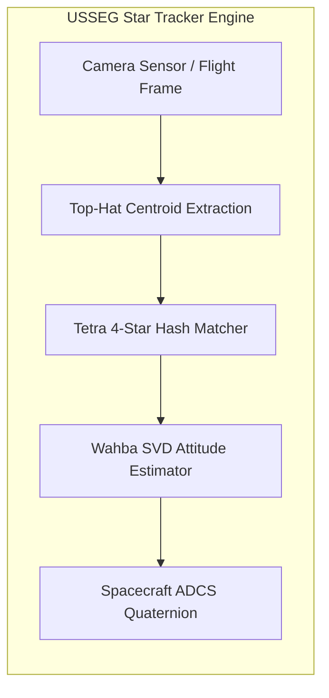

# 📚 Tài Liệu Kỹ Thuật Hệ Thống USSEG Star Tracker

<div align="center">

**Mục Lục Tài Liệu Kỹ Thuật & Thiết Kế Kiến Trúc Hệ Thống**  
*Comprehensive Technical Documentation & Architecture Reference*

---

<!-- Navigation Bar -->
<p>
  <a href="../README.md#-tài-liệu-tiếng-việt"></a>
  &nbsp;&nbsp;
  <a href="06_roadmap_and_improvements.md"></a>
</p>

---

</div>

<br/>

## 📑 Danh Mục Tài Liệu Kỹ Thuật Hệ Thống (Đánh Số Thứ Tự)

| Số hiệu | Tên tài liệu | Nội dung trọng tâm |
|:---:|---|---|
| **01** | **[Kiến Trúc Hệ Thống (System Architecture)](01_system_architecture.md)** | So sánh kiến trúc LOST (C++) và USSEG (Python), sơ đồ pipeline từ đầu đến cuối, giải thuật trích xuất tâm sao Top-Hat, nhận dạng hình học Tetra và ước lượng tư thế Wahba SVD. |
| **02** | **[Báo Cáo So Sánh Benchmark (Benchmark Comparison)](02_benchmark_comparison.md)** | Kết quả thực nghiệm định lượng trên ảnh giả lập và 1.111 khung ảnh quỹ đạo thực tế DUST V2 (CASSIOPE FAI), phân tích độ trễ, độ nhạy tách sao và nguyên nhân gốc rễ. |
| **03** | **[Từ Điển Dữ Liệu & Schemas (Data Dictionary & Schemas)](03_data_dictionary_and_schemas.md)** | Đặc tả định dạng dữ liệu JSON/CSV, hệ tọa độ điểm ảnh, danh mục sao (BSC5 so với CDS Hipparcos), và chuẩn hóa quy ước quaternion chủ động / bị động. |
| **04** | **[Sơ Đồ Tuần Tự Thực Thi (Sequence Diagrams)](04_sequence_diagrams.md)** | Sơ đồ tuần tự tương tác giữa các module: thực thi benchmark giả lập, quy trình thẩm định mù ảnh chuyến bay thực tế và chu kỳ bám sao tự động Lost-In-Space. |
| **05** | **[Mô Hình Quan Hệ Thực Thể (Entity-Relationship Model)](05_entity_relationship.md)** | Lược đồ dữ liệu quan hệ kết nối giữa các kịch bản thử nghiệm, khung ảnh quang học, tọa độ tâm sao, sao danh mục và các chỉ số đánh giá sai số góc quay. |
| **06** | **[Lộ Trình Cải Thiện & Sẵn Sàng Cho Production (Roadmap & Improvements)](06_roadmap_and_improvements.md)** | Phân tích 4 trụ cột kỹ thuật đưa hệ thống từ TRL 4-5 lên TRL 7-8 sẵn sàng phóng vào vũ trụ, cùng danh mục 5 giai đoạn công việc (Actionable Task Breakdown). |
| **07** | **[Kiểm Toán Nhánh & Tối Ưu Hóa Pipeline (Branch Audit)](07_branch_audit.md)** | Báo cáo chi tiết các tối ưu hóa đã thực hiện (Top-Hat Centroiding, Sub-pixel, sửa lỗi tráo tọa độ, chuẩn hóa quaternion) và quy chuẩn an toàn khi merge nhánh. |

---

## 🏛️ Sơ Đồ Khái Quát Luồng Xử Lý USSEG Star Tracker



---

## 🚀 Hướng Dẫn Truy Cập Nhanh

- **Bắt đầu nhanh với mã nguồn**: Xem file [README.md](../README.md) tại thư mục gốc của dự án.
- **Tải bộ dữ liệu quỹ đạo DUST V2**: Chạy công cụ tải tự động tại [examples/download_dust.py](../examples/download_dust.py).
- **Chạy kiểm thử tích hợp tự động**:
  ```bash
  pytest examples/tests -v
  ```
- **Kế hoạch triển khai sắp tới**: Xem chi tiết tại [06_roadmap_and_improvements.md](06_roadmap_and_improvements.md).
