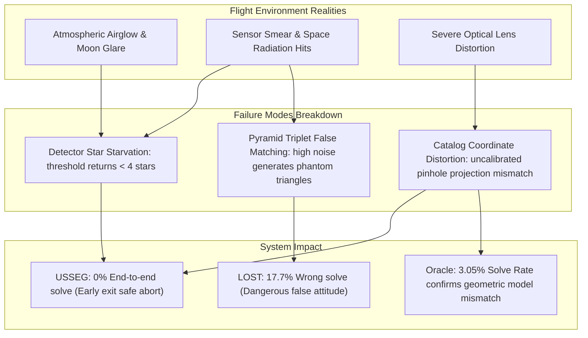

# Star Tracker Benchmark Comparison: LOST vs USSEG

This document provides a comprehensive quantitative and qualitative evaluation comparing **LOST** and **USSEG** across two distinct benchmarks:
1. **Synthetic LOST-evals Pilot Benchmark**: 100 deterministic synthetic star images per scenario under varying field-of-view (20° and 45°) and noise levels (low and high noise).
2. **DUST V2 Real-World Flight Benchmark**: 1,111 orbital night-sky camera frames across 17 flight sessions from the Canadian CASSIOPE Fast Auroral Imager (FAI).

---

## 1. Synthetic LOST-evals Pilot Benchmark

### 1.1 Methodology
- **Run Date**: 2026-08-24. **Environment**: Python 3.10.21, Ubuntu on x86_64.
- **Dataset**: 100 deterministic images generated by LOST for each scenario.
- **Success Criteria**: Correct attitude defined as angular rotation error $\Delta\theta < 0.5^\circ$.
- **Latency Accounting**: Compute latency excludes disk PNG reading to allow fair comparison with LOST internal pipeline timer. End-to-end latency includes disk image reading.

### 1.2 Performance Results

| Scenario | Algorithm | Availability (Solve Rate) | Wrong Solve Rate | No Solve Rate | Mean Attitude Error (Correct) | Compute Latency Mean | Compute P50 | Compute P95 | Compute FPS | End-to-end Mean Latency |
|---|---|---:|---:|---:|---:|---:|---:|---:|---:|---:|
| **20° low noise** | LOST | **98.0%** | 0.0% | 2.0% | **0.008925°** | **3.917 ms** | **2.243 ms** | **3.474 ms** | **255.27** | — |
| **20° low noise** | USSEG | 87.0% | 0.0% | 13.0% | 0.016670° | 33.803 ms | 10.163 ms | 166.485 ms | 29.58 | 49.167 ms |
| **20° high noise** | LOST | **72.0%** | 0.0% | 28.0% | 0.083360° | **8.012 ms** | **3.465 ms** | **29.739 ms** | **124.81** | — |
| **20° high noise** | USSEG | 6.0% | 0.0% | 94.0% | **0.020041°** | 18.787 ms | 5.085 ms | 67.948 ms | 53.23 | 34.855 ms |
| **45° low noise** | LOST | **100.0%** | 0.0% | 0.0% | **0.007062°** | **2.636 ms** | **2.550 ms** | **3.329 ms** | **379.34** | — |
| **45° low noise** | USSEG | 98.0% | 0.0% | 2.0% | 0.032417° | 68.596 ms | 36.793 ms | 257.673 ms | 14.58 | 84.860 ms |
| **45° high noise** | LOST | **91.0%** | 8.0% | 1.0% | **0.030073°** | **9.756 ms** | **4.056 ms** | **29.969 ms** | **102.50** | — |
| **45° high noise** | USSEG | 73.0% | **0.0%** | 27.0% | 0.045051° | 234.007 ms | 239.053 ms | 439.664 ms | 4.27 | 252.565 ms |

### 1.3 Key Findings on Synthetic Images
1. **Zero False Positives for USSEG**: In all tested synthetic scenarios, USSEG achieved **0.0% wrong solves**. When input stars are ambiguous or corrupted by noise, USSEG safely aborts rather than providing an incorrect attitude estimate.
2. **LOST False Solves under Noise**: In the 45° high noise scenario, LOST produced **8.0% wrong solves**, which can destabilize spacecraft Attitude Determination and Control Systems (ADCS).
3. **Speed Advantage of LOST**: LOST is consistently 5x to 25x faster in compute time due to C++ implementation and compact K-Vector tables.
4. **20° High-Noise Centroid Bottleneck**: USSEG experienced a 94.0% no-solve rate at 20° high noise because the simple global threshold detector (`mean + 3*sigma`) returned an average of only 4.32 centroids, starving Tetra3 of the minimum 4 stars needed for pattern matching.

---

## 2. DUST V2 Real-World Flight Benchmark

### 2.1 Flight Dataset Overview
- **Instrument**: Fast Auroral Imager (FAI) on CASSIOPE satellite (orbit altitude ~300–1500 km).
- **Test Holdout Set**: 1,111 frames across 17 sessions (919 frames with plate-solved WCS reference).
- **Ground Truth**: WCS solution from Astrometry.net (pseudo-ground-truth) and Tycho-2 matched star centroids (`Corr`).
- **Input Formats**:
  * **H5 Track**: Raw 16-bit FAI Level-1 scientific HDF5 images (spatially cropped `[12:268, :]`, flipped vertically `flipud`, calibrated via `h5-scale.json`).
  * **PNG Track**: Processed 8-bit grayscale flight images.

### 2.2 End-to-End Performance (Corrected-v3 Benchmark)

| Input Track | Algorithm | Total Frames | Solve Rate (Micro / Macro) | Correct <0.5° (Micro / Macro) | Correct / Solved Ratio | Wrong Solve Rate | Attitude Error P50 / P95 | Compute Latency P50 / P95 | Compute FPS |
|---|---|---:|---:|---:|---:|---:|---:|---:|---:|
| **H5 Track** | LOST | 1,111 | 17.822% / 18.932% | 0.109% / 0.085% | 0.610% | 17.737% | 128.843° / 172.005° | 59.879 / 178.685 ms | 13.271 |
| **H5 Track** | USSEG | 1,111 | 0.000% / 0.000% | 0.000% / 0.000% | — | 0.000% | — / — | 0.734 / 18.768 ms | 179.579 |
| **PNG Track** | LOST | 1,111 | 4.590% / 3.066% | 0.000% / 0.000% | 0.000% | 5.550% | 98.025° / 173.631° | 0.168 / 144.358 ms | 76.295 |
| **PNG Track** | USSEG | 1,111 | 0.000% / 0.000% | 0.000% / 0.000% | — | 0.000% | — / — | 15.379 / 650.946 ms | 9.377 |

### 2.3 Detection, Centroid Quality & Temporal Continuity

| Input Track | Algorithm | Labeled-Star Recall | Centroid Residual P50 | End-to-End Latency P50 / P95 | End-to-End FPS | Temporal Continuity | Longest Outage Duration |
|---|---|---:|---:|---:|---:|---:|---:|
| **H5 Track** | LOST | 19.465% | 1.034 px | 80.801 / 201.317 ms | 10.267 | 5.501% | 58 frames |
| **H5 Track** | USSEG | 5.901% | **0.787 px** | 6.458 / 24.303 ms | 89.528 | 0.000% | 139 frames |
| **PNG Track** | LOST | 5.078% | 0.814 px | 19.348 / 162.806 ms | 29.635 | 1.369% | 139 frames |
| **PNG Track** | USSEG | **11.426%** | **0.313 px** | 18.548 / 652.768 ms | 9.154 | 0.000% | 139 frames |

### 2.4 Oracle Centroid Diagnostic (Bypassing Image Detector)

To isolate detector limitations from pattern matching capabilities, ground-truth centroids from Tycho-2 `Corr` were injected directly into the USSEG Tetra3 solver:

| Eligible Corr Frames | Solve Count | Solve Rate | Correct <0.5° (All Frames) | Correct <0.5° (Among Solved) | Attitude Error P50 / P95 | Mean Star Matches |
|---:|---:|---:|---:|---:|---:|---:|
| 918 | 28 | 3.050% | 0.545% | 17.857% | 0.969° / 2.697° | 8.357 |

### 2.5 Astrometry.net Published Baseline Comparison
- **Astrometry.net WCS Solve Rate**: **82.718%** micro (919/1,111 frames), **81.308%** macro across sessions.
- **Catalog Coverage within 60 arcsec**:
  * LOST Bright Star Catalog (mag $\le 5.0$): **49.083%**
  * USSEG Hipparcos Catalog (mag $\le 7.0$): **86.969%**

---

## 3. Deep-Dive Root Cause & Bottleneck Analysis

*Figure 5: Root cause hierarchy of real-world star tracking failure modes on DUST V2 flight imagery.*

1. **Detector Sensitivity on Faint / Diffuse Stars**:
   - The simple global threshold (`mean + 3*sigma`) fails when the image has non-uniform auroral background or high read noise. It only recovered 5.9% (H5) to 11.4% (PNG) of labeled stars.
   - For high noise, fewer than 4 centroids are passed to Tetra3, resulting in instant `no_solve`.

2. **Optical Distortion vs Ideal Pinhole Projection**:
   - Both pipelines assumed an ideal pinhole camera model. The CASSIOPE FAI camera has noticeable wide-angle lens distortion.
   - Even when ground-truth centroids were fed directly (Oracle test), Tetra3 solved only 3.05% of frames because unmodeled radial distortion warped the angular distances beyond Tetra’s tolerance.

3. **High FPS vs Real-Time Success**:
   - USSEG reports 179.6 Compute FPS on H5, but this is a consequence of early abort when <4 stars are detected.
   - True real-time metric must couple FPS with availability.

4. **Recommendation for Production Flight Ready Star Tracker**:
   - Implement localized adaptive thresholding (e.g. Otsu or localized background subtraction).
   - Integrate camera calibration polynomial (Brown-Conrady radial/tangential distortion model).
   - Add tracking mode (MEKF) to bridge short centroiding outages.
