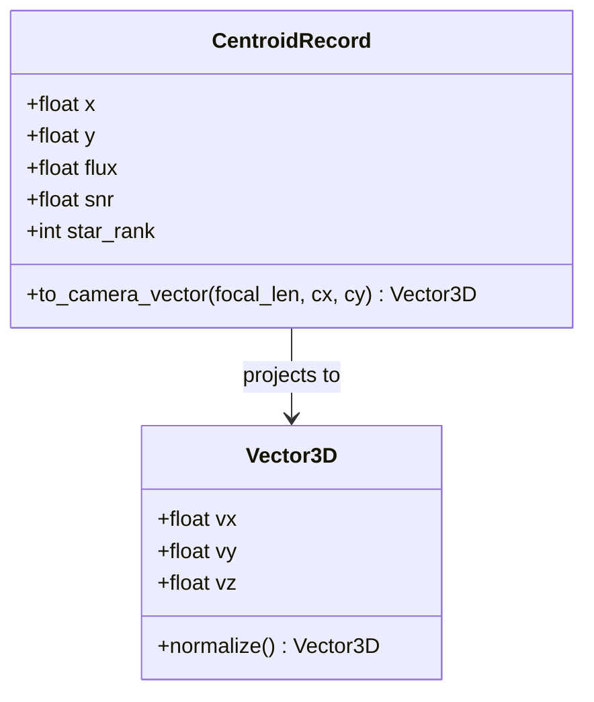
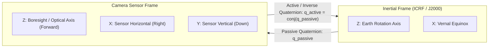

# Star Tracker Data Dictionary & Schemas

This document defines the formal data dictionary, input/output schemas, coordinate systems, and file formats used across the LOST and USSEG star tracking pipelines and the evaluation harness.

---

## 1. Sensor Input Schemas

### 1.1 Synthetic & Preprocessed Grayscale PNG
- **File Format**: Portable Network Graphics (`.png`)
- **Bit Depth**: 8-bit unsigned integer (`uint8`, values 0 to 255).
- **Channels**: 1 (Grayscale single-channel).
- **Coordinate System**: Image coordinates with $(0, 0)$ at the top-left pixel.
  * $x \in [0, W-1]$: Horizontal column index (rightwards).
  * $y \in [0, H-1]$: Vertical row index (downwards).

### 1.2 DUST V2 Flight HDF5 (FAI Level-1)
- **File Format**: Hierarchical Data Format 5 (`.h5` / `.hdf5`)
- **Dataset Path**: `/images` or `/FAI_image` (2D or 3D array of unsigned 16-bit integers).
- **Preprocessing Pipeline**:
  1. **Spatial Cropping**: `raw_image[12:268, :]` extracts active CCD lines (256 vertical lines).
  2. **Orientation Normalization**: `np.flipud(...)` corrects sensor mounting orientation.
  3. **Quantization & Scaling**: Dynamic conversion to 8-bit using calibration scales in `h5-scale.json`:
     $$I_{8} = \text{clip}\left(\frac{I_{16} - I_{\min}}{I_{\max} - I_{\min}} \times 255, 0, 255\right)$$

---

## 2. Centroid Extraction Data Schema


*Figure 6: Centroid data representation and vector projection model.*

### 2.1 Centroid Fields Description

| Field Name | Data Type | Units | Range | Description |
|---|---|---|---|---|
| `x` | `float64` | pixels | $[0.0, W-1.0]$ | Subpixel horizontal position (zero-based). |
| `y` | `float64` | pixels | $[0.0, H-1.0]$ | Subpixel vertical position (zero-based). |
| `flux` | `float64` | ADU | $[0.0, \infty)$ | Integrated pixel intensity above local background. |
| `snr` | `float64` | ratio | $[0.0, \infty)$ | Signal-to-noise ratio: peak intensity over local background variance. |
| `star_rank` | `int32` | index | $[1, 20]$ | Brightness rank among extracted candidates (1 = brightest). |

---

## 3. Star Catalog Schemas

### 3.1 Bright Star Catalog (BSC5) - Used by LOST
- **Coverage**: All-sky, stars with Visual Magnitude $V \le 5.0$.
- **Database Size**: ~0.443 MiB in custom binary format.

| Field | Type | Description |
|---|---|---|
| `bsc_id` | `int32` | Bright Star Catalog identifier (Harvard Revised number). |
| `ra_rad` | `float64` | Right Ascension in radians (ICRF / J2000 epoch). |
| `dec_rad` | `float64` | Declination in radians (ICRF / J2000 epoch). |
| `vmag` | `float32` | Visual magnitude. |
| `unit_vector` | `float64[3]` | Cartesian unit vector $[v_x, v_y, v_z]$ on Celestial Sphere. |

### 3.2 Hipparcos Catalog (`hip_main.dat`, CDS I/239) - Used by USSEG
- **Coverage**: Complete 118,218 stars down to Visual Magnitude $V \le 7.0$.
- **Database File**: Compressed NumPy archive (`default_database.npz`, ~47.1 MiB).

| Field | Type | Description |
|---|---|---|
| `hip_id` | `int32` | Hipparcos Catalog identifier (1 to 120404). |
| `ra_deg` | `float64` | Right Ascension in degrees (J2000 epoch). |
| `dec_deg` | `float64` | Declination in degrees (J2000 epoch). |
| `vmag` | `float32` | Visual magnitude (Johnson V band). |
| `bv_color` | `float32` | B-V color index. |
| `star_table` | `float64[N, 3]` | Unit vectors in J2000 inertial frame. |
| `pattern_catalog` | `int32[M, 4]` | 4-star combination indices corresponding to hash keys. |

---

## 4. Attitude Quaternion & Coordinate Conventions

### 4.1 Quaternion Schema
Attitudes are represented as normalized 4-element unit quaternions:
$$\mathbf{q} = [w, x, y, z]^T, \quad w^2 + x^2 + y^2 + z^2 = 1$$
where $w$ is the scalar part and $[x, y, z]$ is the vector part.

### 4.2 Convention Disambiguation


*Figure 7: Coordinate transformations between ECI J2000 and Camera Sensor Frame.*

- **USSEG Internal Representation**: Passive quaternion $\mathbf{q}_{I \to C}$ transforming vectors from Inertial (ECI J2000) to Camera Frame:
  $$\mathbf{v}_C = \mathbf{q}_{I \to C} \otimes \mathbf{v}_I \otimes \mathbf{q}_{I \to C}^*$$
- **LOST Representation & Ground Truth**: Active rotation $\mathbf{q}_{C \to I}$ mapping Camera coordinates into Inertial:
  $$\mathbf{v}_I = \mathbf{q}_{C \to I} \otimes \mathbf{v}_C \otimes \mathbf{q}_{C \to I}^*$$
- **Conversion Identity**:
  $$\mathbf{q}_{C \to I} = \mathbf{q}_{I \to C}^* = [w, -x, -y, -z]^T$$

---

## 5. Evaluation Harness Output Schemas

### 5.1 JSON Output Record (`usseg_pipeline` execution)
Example of output JSON emitted per image:
```json
{
  "frame_id": "0.png",
  "status": "solved",
  "fov_deg": 20.0,
  "quaternion_wxyz": [0.999847, 0.012301, -0.008912, 0.009102],
  "quaternion_passive_wxyz": [0.999847, -0.012301, 0.008912, -0.009102],
  "num_detected_stars": 18,
  "num_matched_stars": 12,
  "residual_rmse_deg": 0.00891,
  "timings_ns": {
    "detection_ns": 4210500,
    "plate_solve_ns": 8912400,
    "attitude_ns": 112000,
    "total_ns": 13234900
  },
  "compute_fps": 75.56
}
```

### 5.2 Benchmark Summary Manifest (`smoke_test_usseg.summary.csv`)
Columns:
1. `scenario`: Scenario name (e.g. `20-low-noise`, `45-high-noise`, `dust-dev`).
2. `algorithm`: `lost` or `usseg`.
3. `total_frames`: Count of frames evaluated.
4. `solve_count`: Count of successfully solved frames.
5. `solve_rate`: Percentage of frames solved.
6. `correct_sub_05_deg`: Percentage of solved frames with attitude error $< 0.5^\circ$.
7. `wrong_solve_rate`: Percentage of solves with attitude error $\ge 0.5^\circ$.
8. `attitude_error_p50_deg`: Median angular error in degrees.
9. `compute_latency_p50_ms`: Median algorithm compute time in milliseconds.
10. `compute_fps`: Processing speed in frames per second.
