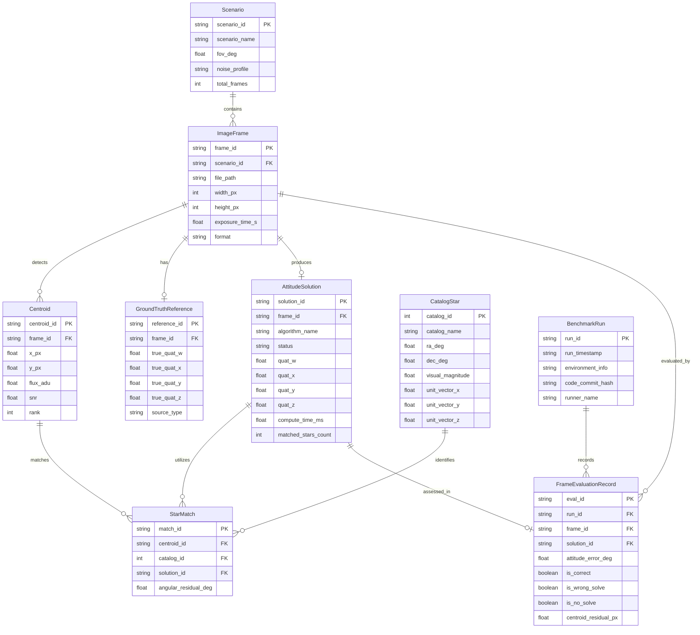

# Star Tracker Entity-Relationship Diagram & Data Model

This document defines the relational data model connecting benchmark scenarios, image frames, detected centroids, catalog stars, identified matches, attitude solutions, and evaluation metrics across the star tracking system.

---

## 1. Entity-Relationship Diagram

*Figure 11: Entity-relationship diagram for star tracker benchmarking and execution data model.*

---

## 2. Entity Dictionary & Attributes

### 2.1 `Scenario`
Represents an evaluation configuration or simulation envelope.
- `scenario_id` (PK, string): Unique identifier (e.g. `20-low-noise`, `dust-v2-test`).
- `fov_deg` (float): Camera field-of-view in degrees.
- `noise_profile` (string): Noise characteristics (`ideal`, `low_gaussian`, `flight_auroral`).
- `total_frames` (int): Number of frames in the scenario.

### 2.2 `ImageFrame`
An individual camera exposure or simulated raster.
- `frame_id` (PK, string): Frame identifier (e.g. `0.png`, `2023_06_19_001.h5`).
- `file_path` (string): Relative or absolute filesystem path.
- `width_px`, `height_px` (int): Pixel dimensions.
- `exposure_time_s` (float): Exposure duration in seconds.

### 2.3 `Centroid`
A candidate star spot extracted by the image detector.
- `centroid_id` (PK, string): Unique detection identifier.
- `x_px`, `y_px` (float): Subpixel image coordinates (zero-based).
- `flux_adu` (float): Integrated pixel energy above background.
- `snr` (float): Signal-to-noise ratio.
- `rank` (int): Brightness ranking among candidate spots in the frame.

### 2.4 `CatalogStar`
A reference celestial object from a standardized catalog.
- `catalog_id` (PK, int): Identifier (BSC number or Hipparcos HIP number).
- `catalog_name` (string): Originating catalog (`BSC5` or `Hipparcos`).
- `ra_deg`, `dec_deg` (float): Celestial coordinates (Right Ascension / Declination) in J2000 epoch.
- `unit_vector_x/y/z` (float): Precomputed 3D unit coordinates on Celestial Sphere.

### 2.5 `StarMatch`
An association between a detected 2D centroid and a 3D catalog star established by pattern recognition.
- `match_id` (PK, string): Match identifier.
- `angular_residual_deg` (float): Angular separation between rotated sensor vector and true catalog vector.

### 2.6 `AttitudeSolution`
The estimated attitude quaternion and runtime telemetry produced by the pipeline.
- `solution_id` (PK, string): Solution instance identifier.
- `status` (string): Result state (`solved`, `no_solve`, `timeout`, `error`).
- `quat_w`, `quat_x`, `quat_y`, `quat_z` (float): Unit quaternion components (scalar-first).
- `compute_time_ms` (float): Execution latency of algorithm stages in milliseconds.

### 2.7 `GroundTruthReference`
The verified reference attitude and star field truth.
- `reference_id` (PK, string): Reference record identifier.
- `true_quat_w/x/y/z` (float): Reference quaternion.
- `source_type` (string): Origin (`simulator_exact`, `astrometry_wcs_pseudotruth`).

### 2.8 `FrameEvaluationRecord`
The audit outcome comparing a pipeline's `AttitudeSolution` against the `GroundTruthReference`.
- `eval_id` (PK, string): Audit record identifier.
- `attitude_error_deg` (float): Angular geodesic distance between solution and ground truth:
  $$\Delta\theta = 2 \arccos(|\mathbf{q}_{est} \cdot \mathbf{q}_{true}|)$$
- `is_correct` (boolean): `true` if $\Delta\theta < 0.5^\circ$.
- `is_wrong_solve` (boolean): `true` if solved, but $\Delta\theta \ge 0.5^\circ$.
- `is_no_solve` (boolean): `true` if algorithm returned no solution.
